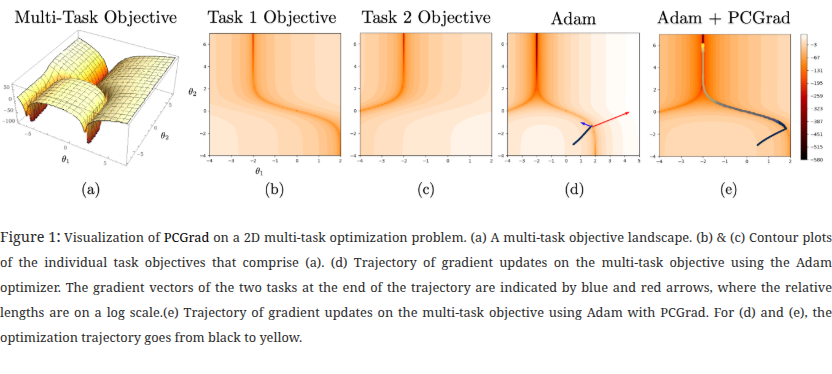
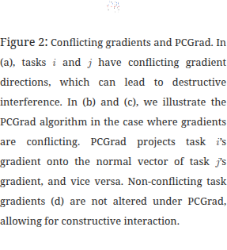
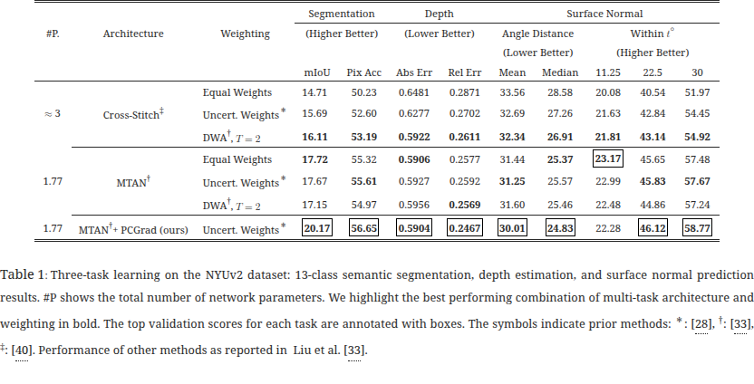
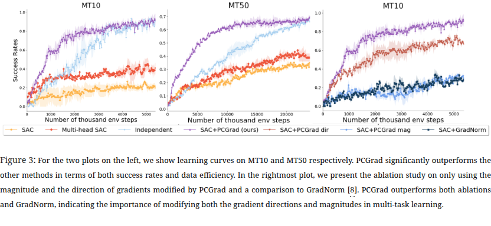
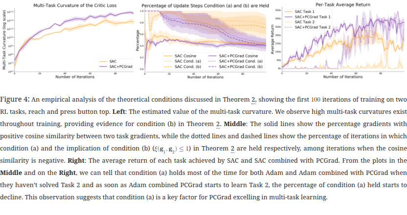

# Gradient Surgery for Multi-Task Learning (PCGrad)

## 基本信息
- **标题:** Gradient Surgery for Multi-Task Learning
- **作者:** Tianhe Yu, Saurabh Kumar, Abhishek Gupta, Sergey Levine, Karol Hausman, Chelsea Finn
- **机构:** Stanford University, UC Berkeley, Robotics at Google
- **发表:** NeurIPS 2020
- **链接:** https://arxiv.org/abs/2001.06782
- **代码:** https://github.com/tianheyu927/PCGrad
- **论文类型:** Empirical

## 研究问题
- **解决什么问题？** 多任务学习中，不同任务的梯度之间存在冲突（conflicting gradients），导致优化困难，性能甚至不如独立训练各任务。
- **关键假设:** 多任务学习优化困难的根源在于"悲剧三元组"（Tragic Triad）的共同出现：(a) 梯度冲突（cosine similarity < 0），(b) 梯度幅度差异大（某个任务梯度主导），(c) 高曲率（导致对主导任务的改进被高估，对被主导任务的退化被低估）。
- **为什么重要？** 多任务学习理论上可以通过共享结构提升数据效率，但实际中优化困难使得这一优势难以实现。解决梯度冲突问题是释放多任务学习潜力的关键。

## 技术方法

### 整体框架与原理

PCGrad（Projecting Conflicting Gradients）的核心思想是"梯度手术"：当两个任务的梯度方向冲突时，将一个任务的梯度投影到另一个任务梯度的法平面上，从而消除梯度中相互干扰的分量。

### 核心组件详解

**悲剧三元组（Tragic Triad）的形式化定义：**

1. **梯度冲突：** 两个任务梯度 $\mathbf{g}_i$ 和 $\mathbf{g}_j$ 的夹角 $\phi_{ij}$ 满足 $\cos\phi_{ij} < 0$
2. **梯度幅度相似度：** $\Phi(\mathbf{g}_i, \mathbf{g}_j) = \frac{2\|\mathbf{g}_i\|_2 \|\mathbf{g}_j\|_2}{\|\mathbf{g}_i\|_2^2 + \|\mathbf{g}_j\|_2^2}$，值趋近 0 表示幅度差异大
3. **多任务曲率：** $\mathbf{H}(\mathcal{L}; \theta, \theta') = \int_0^1 \nabla\mathcal{L}(\theta)^T \nabla^2\mathcal{L}(\theta + a(\theta'-\theta)) \nabla\mathcal{L}(\theta) da$

**PCGrad 算法：**

对于任务 $i$ 的梯度 $\mathbf{g}_i$ 和任务 $j$ 的梯度 $\mathbf{g}_j$：
- 如果 $\mathbf{g}_i \cdot \mathbf{g}_j < 0$（冲突），则将 $\mathbf{g}_i$ 投影到 $\mathbf{g}_j$ 的法平面：
  $$\mathbf{g}_i^{PC} = \mathbf{g}_i - \frac{\mathbf{g}_i \cdot \mathbf{g}_j}{\|\mathbf{g}_j\|^2} \mathbf{g}_j$$
- 如果不冲突，保持 $\mathbf{g}_i$ 不变
- 对所有任务对随机顺序迭代执行此投影

**关键特性：**
- 与模型架构无关（model-agnostic），只修改共享参数的梯度
- 无额外超参数
- 可与其他多任务学习方法（如 MTAN、Routing Networks）组合使用
- 适用于监督学习和强化学习（包括 actor-critic 方法）

## 实验结果

### 多任务监督学习

- **NYUv2（3 任务）：** PCGrad + MTAN 在语义分割（mIoU 20.17 vs 17.72）、深度估计、表面法线预测上全面超越基线
- **CIFAR-100（20 任务）：** PCGrad 单独达到 71% 准确率；与 Routing Networks 结合达到 77.5%，提升 2.8%
- **CelebA（40 任务）：** 平均分类错误率 8.69%，优于 Sener & Koltun 的 8.95%

### 多任务强化学习

- **Meta-World MT10/MT50：** PCGrad 在成功率和数据效率上显著优于其他方法
- **消融实验：** 同时修改梯度的方向和幅度（PCGrad 完整版）比仅修改方向或仅修改幅度效果更好

### 悲剧三元组的实证验证

- 在 RL 任务训练初期，高多任务曲率、梯度冲突、梯度幅度差异三个条件同时存在
- PCGrad 有效降低了梯度冲突的程度，从而改善优化

## 总结
- **核心思想：** 通过"梯度手术"——将冲突任务的梯度投影到彼此法平面上——消除多任务学习中的梯度干扰
- **主要亮点：** 方法极其简洁（无额外超参数），与模型架构无关，可即插即用地与现有多任务架构组合；在监督学习和强化学习上均取得显著提升
- **未来方向：** 可扩展到元学习、持续学习、多智能体优化、NLP 多任务等场景；梯度手术的思想可能对解决双人博弈和多智能体优化中的稳定性问题也有帮助
- **局限性：** 理论分析仅覆盖了两任务情形的局部条件；随机任务顺序的投影在任务数量极大时计算开销增加；未深入分析在哪些任务组合下 PCGrad 可能失效（如任务间几乎无共享结构时）
