# 论文总结：Diffusion Policy: Visuomotor Policy Learning via Action Diffusion

## 1. 这个工作解决了一个什么问题？

**核心问题**：如何让机器人通过模仿学习更好地生成行为策略。

现有的策略学习方法面临三大挑战：
1. **多模态动作分布**：同一状态可能有多种合理的动作选择
2. **高维动作空间**：需要预测长时序动作序列
3.训练不稳定：能量基模型需要负采样来估计归一化常数

本文提出 **Diffusion Policy**，将视觉运动策略表示为条件去噪扩散过程，在动作空间上执行条件扩散。

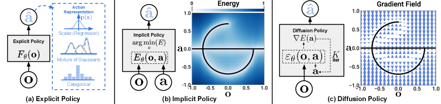

## 2. What / Who / How / Why

| 要素 | 内容 |
|------|------|
| **What** | 提出 Diffusion Policy，通过在机器人动作空间上条件扩散过程来生成视觉运动策略 |
| **Who** | Cheng Chi, Zhenjia Xu, Siyuan Feng 等（Columbia University） |
| **How** | 学习动作分布 score 函数的梯度，通过随机 Langevin 动力学迭代优化 |
| **Why** | 扩散模型天然适合处理多模态分布、高维输出空间，且训练稳定 |

## 3. 之前的工作及局限性

### 相关工作：

1. **显式策略**（Explicit Policy）
   - 高斯混合模型（MOG）
   - 分类动作表示
   - 难以捕捉多模态分布

2. **隐式策略**（Implicit Policy）
   - 学习能量函数 p(a|o) = e^(-E(o,a))
   - 需估计难以计算的归一化常数 Z(o,θ)
   - 训练不稳定

3. **扩散模型在图像生成**
   - 在图像生成领域效果出色
   - 未应用于机器人策略学习

### 局限性：
- 多模态动作分布难以建模
- 高维动作空间输出困难
- 训练不稳定

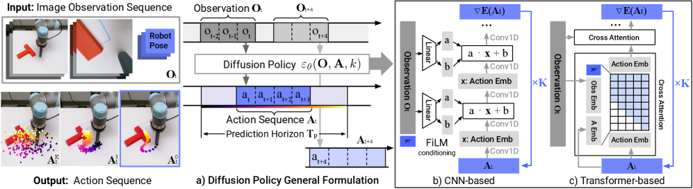

## 4. 方法详解（重点）

### 4.1 扩散模型基础

#### 4.1.1 扩散过程

前向扩散：将数据逐渐加噪
$$x_{k-1} = \alpha(x_k - \gamma\epsilon_\theta(x_k,k) + N(0,I))$$

反向过程：从噪声恢复数据
$$x_{k-1} = \alpha(x_k - \gamma\epsilon_\theta(x_k,k))$$

其中 $\epsilon_\theta$ 是噪声预测网络。

#### 4.1.2 Langevin 动力学

在梯度场上的采样：
$$x' = x - \gamma\nabla E(x)$$

$\epsilon_\theta(x,k)$ 有效预测梯度场 $\nabla E(x)$。

### 4.2 视觉运动扩散策略

#### 4.2.1 条件扩散

给定观察 $O_t$，动作序列 $A_t = [a_t, a_{t+1}, ..., a_{t+H-1}]$

损失函数：
$$L = MSE(\epsilon_k, \epsilon_\theta(O_t, A^0_t + \epsilon_k, k))$$

推理时，从高斯噪声采样，经过 K 步去噪得到动作序列。

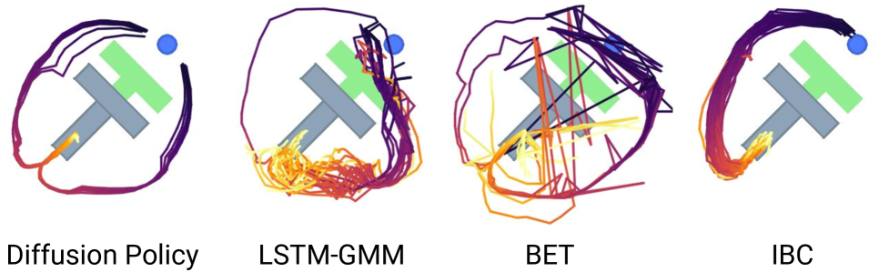

### 4.3 关键设计决策

#### 4.3.1 网络架构

本文评估两种架构：
1. **CNN + MLP**：CNN 处理图像，MLP 处理动作序列
2. **ViT + Transformer**：使用 Vision Transformer 处理视觉，Transformer 处理时序

**DiT（Diffusion Transformer）** 效果最佳：
- 使用 DiT 块处理动作序列
- 视觉特征通过交叉注意力注入

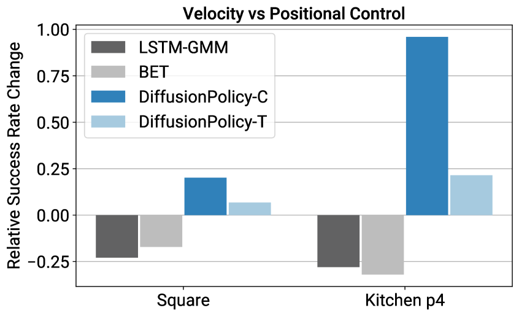

#### 4.3.2 闭环动作序列（Receding Horizon Control）

- 预测 H 步动作序列
- 执行第一步
- 重新观察并重新规划
- 平衡长时序规划和闭环鲁棒性

#### 4.3.3 噪声调度

定义 $\sigma, \alpha, \gamma$ 作为迭代步 k 的函数，控制噪声调度。

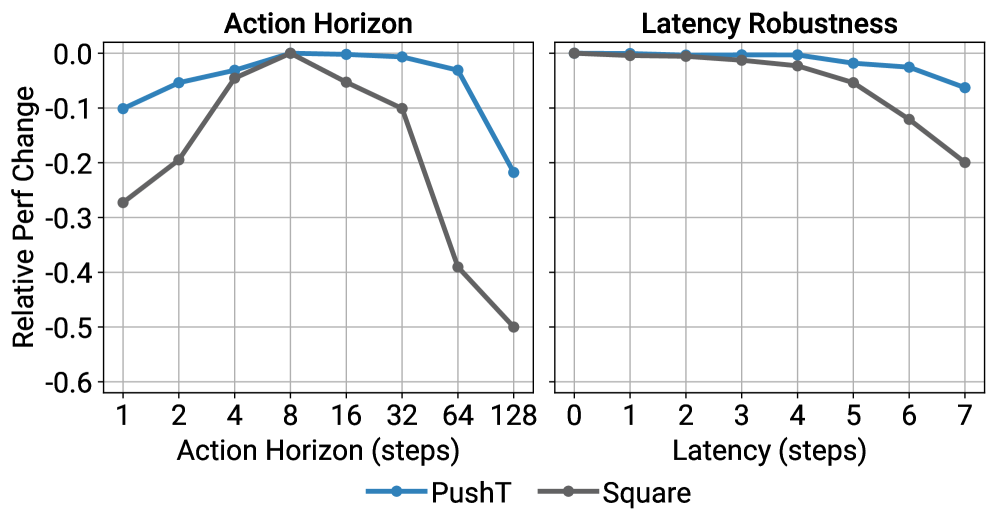

#### 4.3.4 推理加速

- 减少去噪步数 K（本文使用 K=2-10）
- DDIM 采样加速

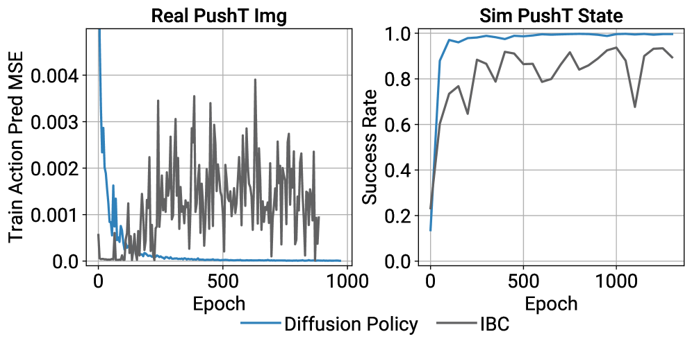

### 4.4 扩散策略的优势

1. **多模态动作分布**：score 函数梯度场可表示任意可归一化分布
2. **高维动作空间**：适合预测长时序动作序列，保持时序一致性
3. **训练稳定**：无需估计归一化常数

## 5. 实验结果

### 实验设置：
- **任务**：15 个任务，来自 4 个机器人操作基准
- **对比方法**：BC, BC-RNN, IML, GATO, RT-1 等
- **评估指标**：成功率

### 主要结果：
- **平均提升 46.9%**
- 在所有 15 个任务上优于现有方法

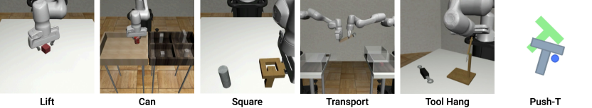

### 消融实验：

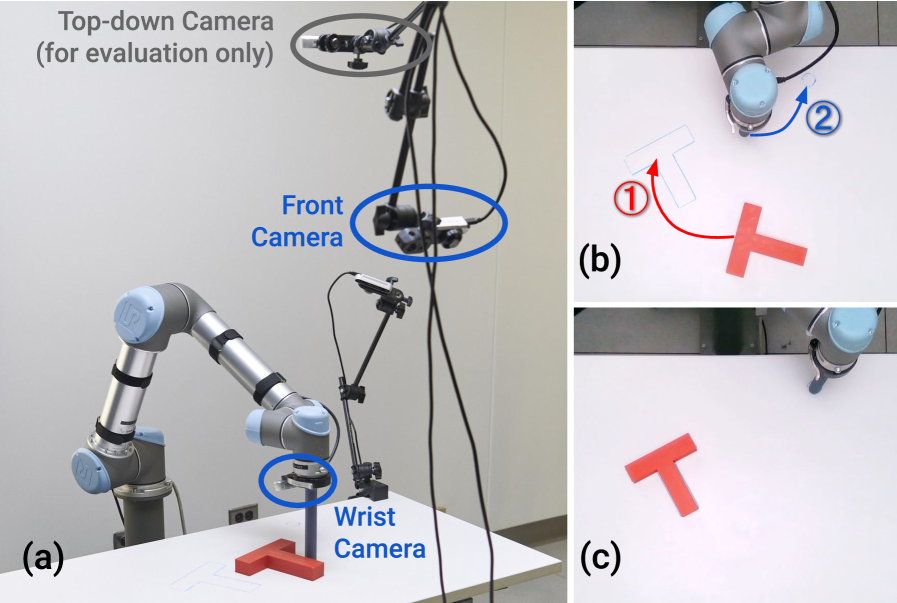

- 验证了动作序列预测的效果
- 验证了 Transformer 架构的优势

### 真实机器人实验：

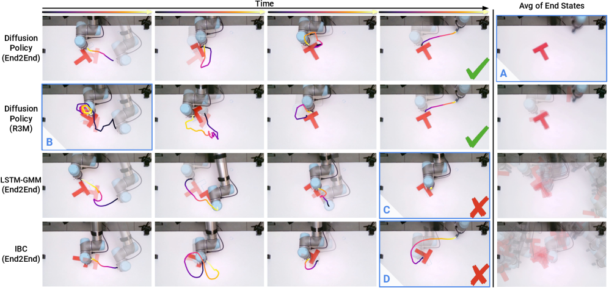

- Push-T 任务
- 倒水任务
- 双臂搅拌任务
- 双臂摊开垫子任务

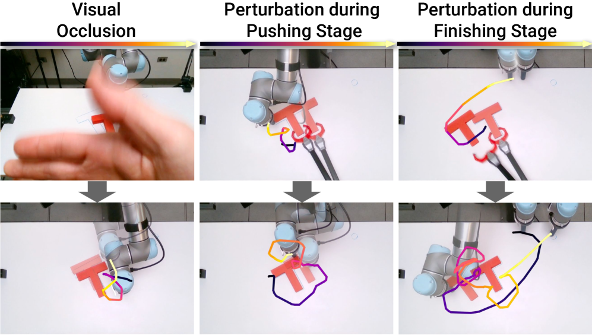
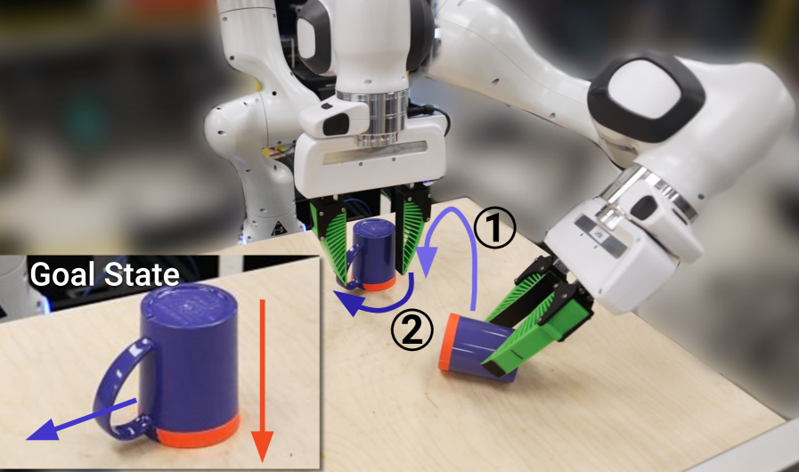
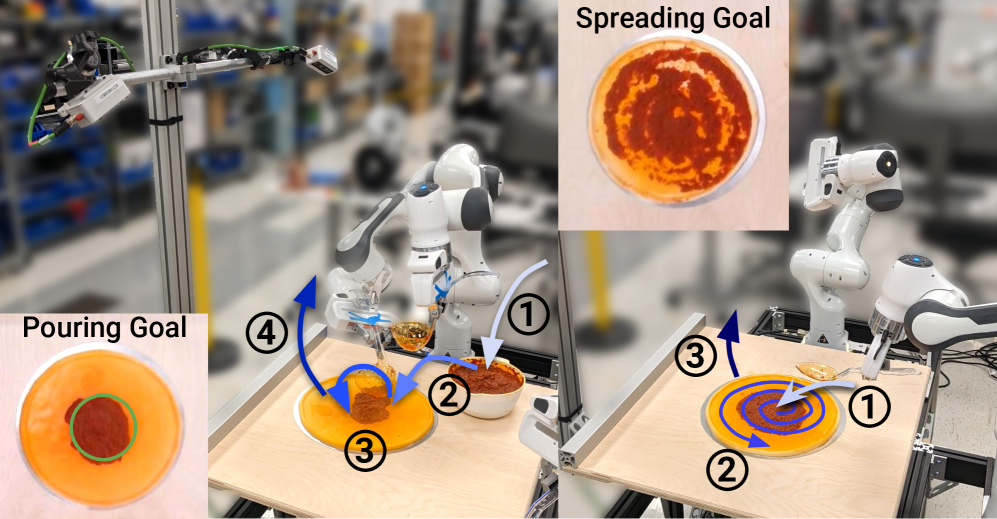
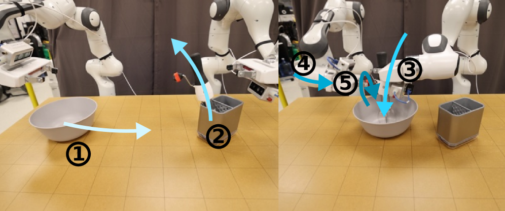
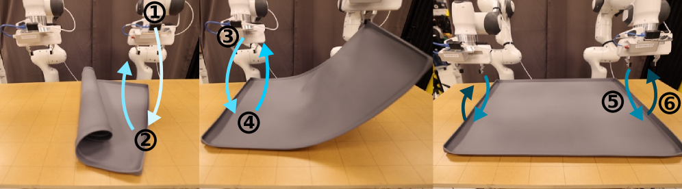
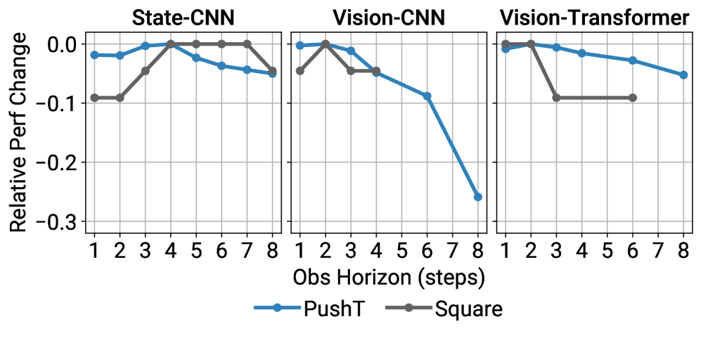
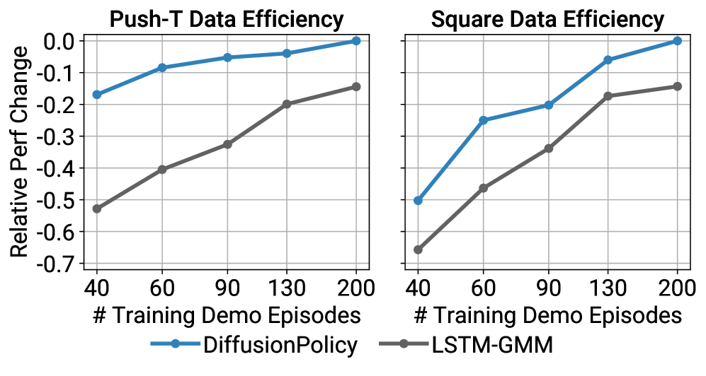

## 6. 总结与思考

### 总结：
- 提出 Diffusion Policy，将扩散模型应用于视觉运动策略学习
- 在 15 个任务上平均提升 46.9%
- 展示扩散策略在多模态、高维输出、训练稳定方面的优势

### 创新点：
1. **条件扩散策略**：在动作空间上进行条件扩散
2. **闭环动作序列**：结合预测控制
3. **DiT 架构**：用于动作序列建模

### 局限性与未来工作：
- 推理速度仍需优化
- 可探索更大规模的预训练
- 拓展到其他机器人任务

### 思考：
- 扩散模型在机器人学中的应用潜力巨大
- 条件扩散提供了一种优雅的多模态策略建模方式
- 动作序列预测对机器人控制至关重要
