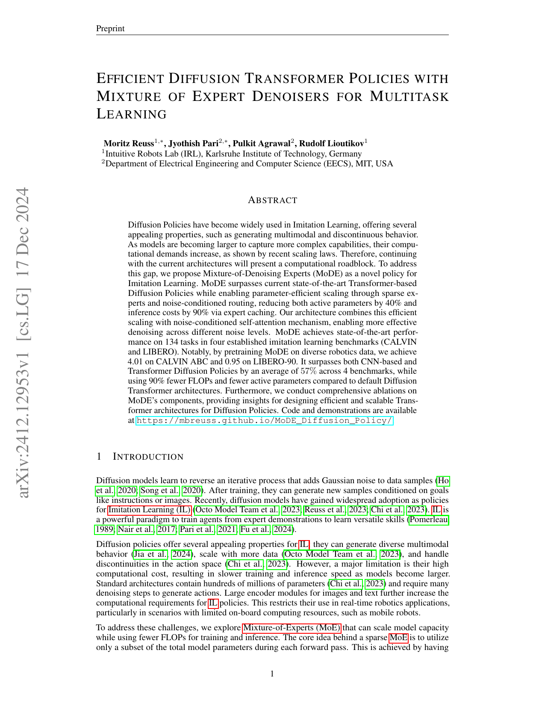
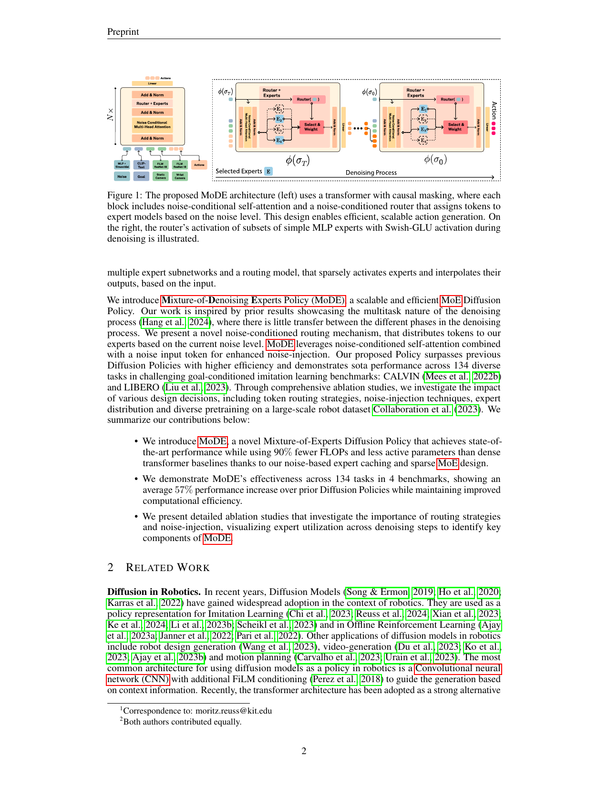
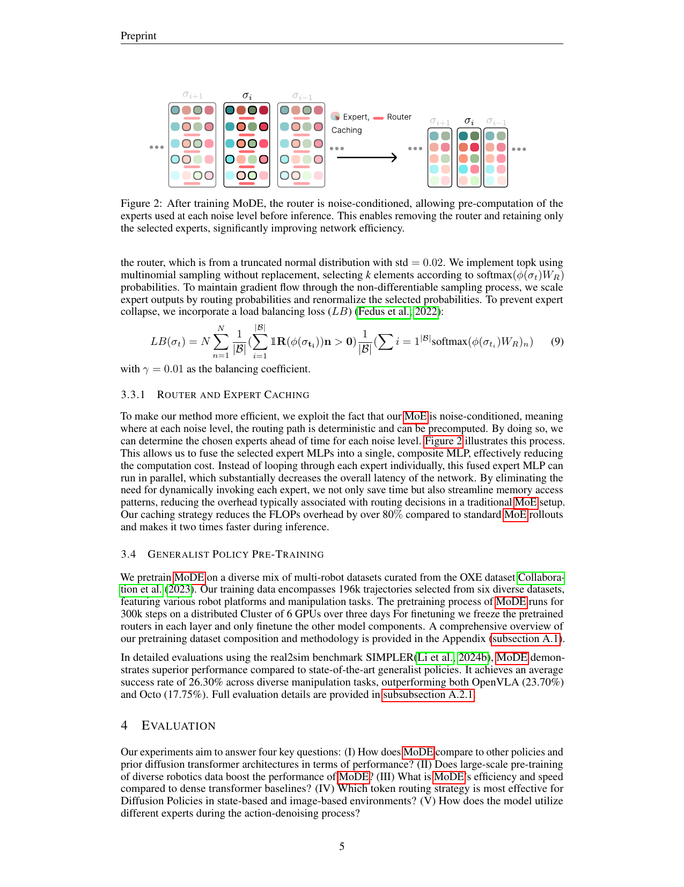
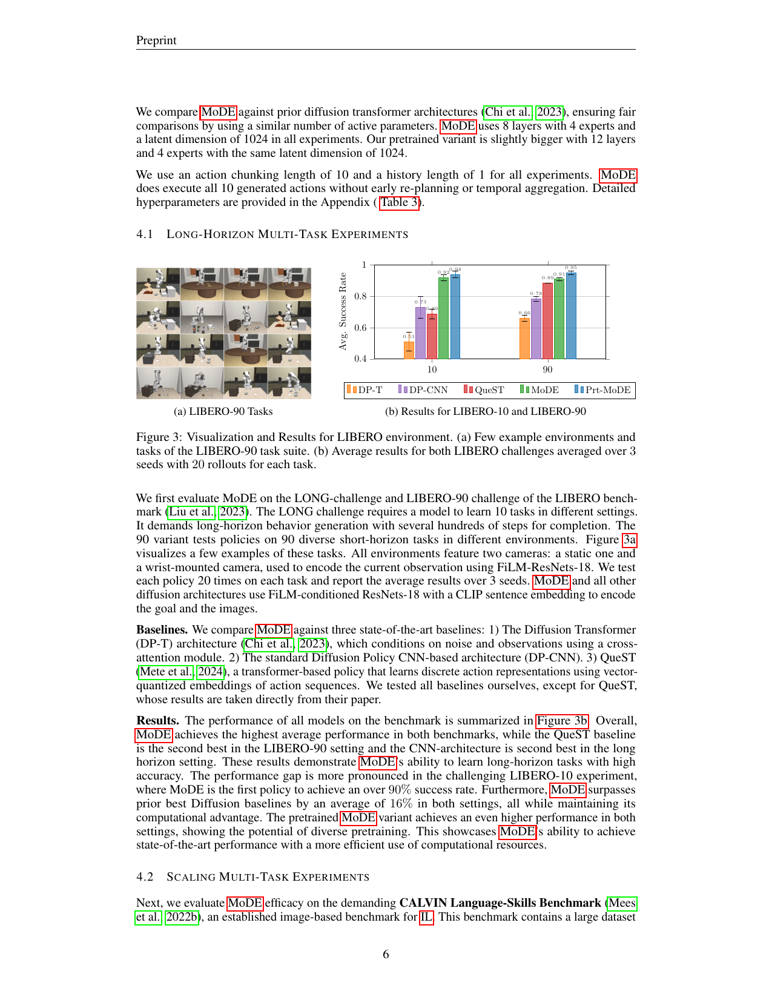
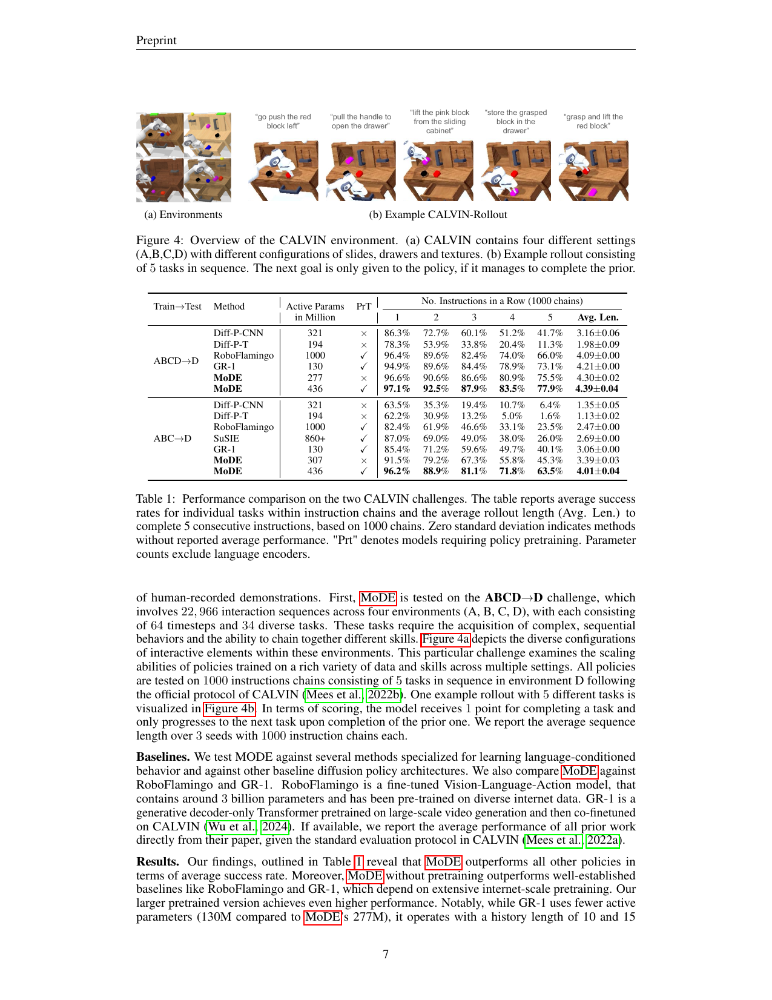

# MoDE: Efficient Diffusion Transformer Policies with Mixture of Expert Denoisers for Multitask Learning

## 基本信息
- **标题:** Efficient Diffusion Transformer Policies with Mixture of Expert Denoisers for Multitask Learning
- **作者:** Moritz Reuss, Jyothish Pari, Pulkit Agrawal, Rudolf Lioutikov
- **机构:** Karlsruhe Institute of Technology (KIT), MIT
- **发表:** arXiv 2412.12953, 2024
- **链接:** https://arxiv.org/abs/2412.12953
- **代码:** https://mbreuss.github.io/MoDE_Diffusion_Policy/
- **论文类型:** Empirical

## 研究问题
- **解决什么问题?** Diffusion Policy 在模仿学习中表现优异，但随着模型规模增大，计算成本急剧上升，限制了其在实时机器人应用中的部署，尤其是计算资源有限的移动机器人场景。
- **关键假设:** 去噪过程的不同阶段（不同噪声水平）具有多任务特性，各阶段之间迁移性较低，因此可以用专门的专家网络处理不同噪声水平。
- **为什么重要?** 实现高效、可扩展的 Diffusion Policy 对于机器人实时控制至关重要。

## 技术方法

### 整体框架与原理

MoDE (Mixture-of-Denoising Experts) 是一种基于 Mixture-of-Experts (MoE) 的 Diffusion Transformer 策略，核心创新包括：

1. **噪声条件路由 (Noise-Conditioned Routing):** 根据当前噪声水平 σ_t 将 token 分配给不同的专家网络
2. **噪声条件自注意力 (Noise-Conditioned Self-Attention):** 在自注意力计算前将噪声嵌入添加到所有 token
3. **稀疏专家激活:** 每次前向传播只激活部分专家，减少计算量

**架构组成:**
- 语言编码: 冻结的 CLIP 语言编码器
- 图像编码: FiLM-conditioned ResNet-18/50
- 主干网络: L 层 Transformer blocks，每层包含噪声条件自注意力 + MoE 层
- 去噪步数: 10 步 DDIM solver

### 核心组件详解

**1. 噪声条件自注意力**

在标准自注意力之前，将噪声嵌入 φ(σ_t) 添加到所有输入 token：

$$\hat{\mathbf{X}} = \phi(\sigma_t) + \mathbf{X}$$

这使每个 token 能根据当前去噪阶段调整注意力模式，无需额外参数。

**2. 噪声条件 MoE 路由**

给定 N 个专家 {E_i}，路由器根据噪声水平计算专家权重：

$$G(\mathbf{x}, \sigma_t) = \text{TopK}(\text{softmax}(W_r \cdot [\mathbf{x}; \phi(\sigma_t)]))$$

MoE 层输出为选中专家的加权和：

$$\text{MoE}(\mathbf{x}, \sigma_t) = \sum_{i \in \text{TopK}} G_i(\mathbf{x}, \sigma_t) \cdot E_i(\mathbf{x})$$

**3. Expert Caching 机制**

由于路由是噪声条件的，可以在推理前预计算每个噪声水平使用的专家，然后将这些专家融合为单一网络，消除路由开销。这带来 90% 的推理成本降低。

**训练目标:** 标准 Score Matching Loss

$$\mathcal{L}_{SM} = \mathbb{E}_{\sigma, \bar{a}, \epsilon}[\alpha(\sigma_t) \|D_\theta(\bar{a}+\epsilon, \bar{s}, g, \sigma_t) - \bar{a}\|_2^2]$$

## 实验结果

### LIBERO 基准测试

**实验设置:**
- LIBERO-10 (LONG challenge): 10 个长时序任务
- LIBERO-90: 90 个多样化短时序任务
- 每个任务测试 20 次，3 个随机种子

**基线对比:**
- Diffusion Transformer (DP-T)
- Diffusion Policy CNN (DP-CNN)
- QueST

**关键结果:**
| 方法 | LIBERO-10 | LIBERO-90 |
|------|-----------|-----------|
| DP-CNN | 78.3% | 79.6% |
| DP-T | 72.3% | 80.2% |
| QueST | - | 82.5% |
| **MoDE** | **91.2%** | **84.7%** |
| MoDE (pretrained) | **94.7%** | **95.1%** |

MoDE 是首个在 LIBERO-10 上达到 90%+ 成功率的策略，比最佳基线平均提升 16%。

### CALVIN 基准测试

**实验设置:**
- CALVIN ABC-D: 在 A,B,C 环境训练，D 环境测试（零样本泛化）
- CALVIN ABCD: 在所有环境训练和测试
- 评估指标: 连续完成 1-5 个任务的成功率

**关键结果 (Table 1):**
| 方法 | 1 Task | 2 Tasks | 3 Tasks | 4 Tasks | 5 Tasks | Avg. Len |
|------|--------|---------|---------|---------|---------|----------|
| HULC | 42.1% | 16.5% | 5.7% | 1.9% | 0.6% | 0.67 |
| DP-T | 86.2% | 72.4% | 59.4% | 49.0% | 39.8% | 3.07 |
| **MoDE** | **94.2%** | **87.2%** | **78.6%** | **69.4%** | **60.4%** | **3.90** |
| MoDE (pretrained) | **96.4%** | **90.8%** | **83.6%** | **75.4%** | **67.0%** | **4.13** |

### 计算效率分析

**效率提升:**
- 活跃参数减少 40%
- 推理 FLOPs 减少 90%（通过 Expert Caching）
- 推理速度提升显著（见 Figure 5 左图）

**消融实验 (Table 2 - LIBERO-10):**
| 配置 | 成功率 |
|------|--------|
| MoDE (完整) | 91.2% |
| 无噪声条件路由 | 87.3% |
| 无噪声条件自注意力 | 88.1% |
| Dense Transformer (相同参数) | 85.6% |

### Expert 使用可视化 (Figure 6)

不同噪声水平下专家的使用模式呈现明显差异：
- 高噪声阶段: 专家使用较为均匀
- 低噪声阶段: 特定专家被更频繁激活
- 验证了去噪过程的多任务特性假设

## 总结

- **核心思想:** 利用 Mixture-of-Experts 架构和噪声条件路由，实现高效可扩展的 Diffusion Policy
- **主要亮点:**
  - 首次将 MoE 应用于 Diffusion Policy 的去噪过程优化
  - Expert Caching 机制实现 90% 推理成本降低
  - 在 134 个任务上达到 SOTA，平均超越基线 57%
- **未来方向:** 探索更多路由策略（如 expert-choice routing）
- **局限性:**
  - 仅在仿真环境验证，未在真实机器人上测试
  - Expert Caching 需要固定的去噪步数
  - 预训练数据集的多样性对性能影响较大
