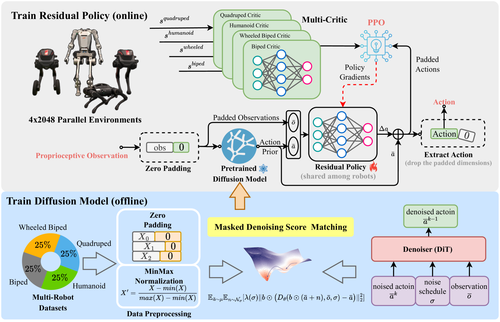
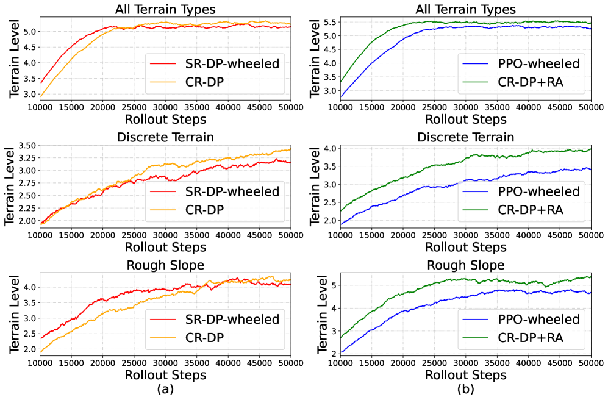
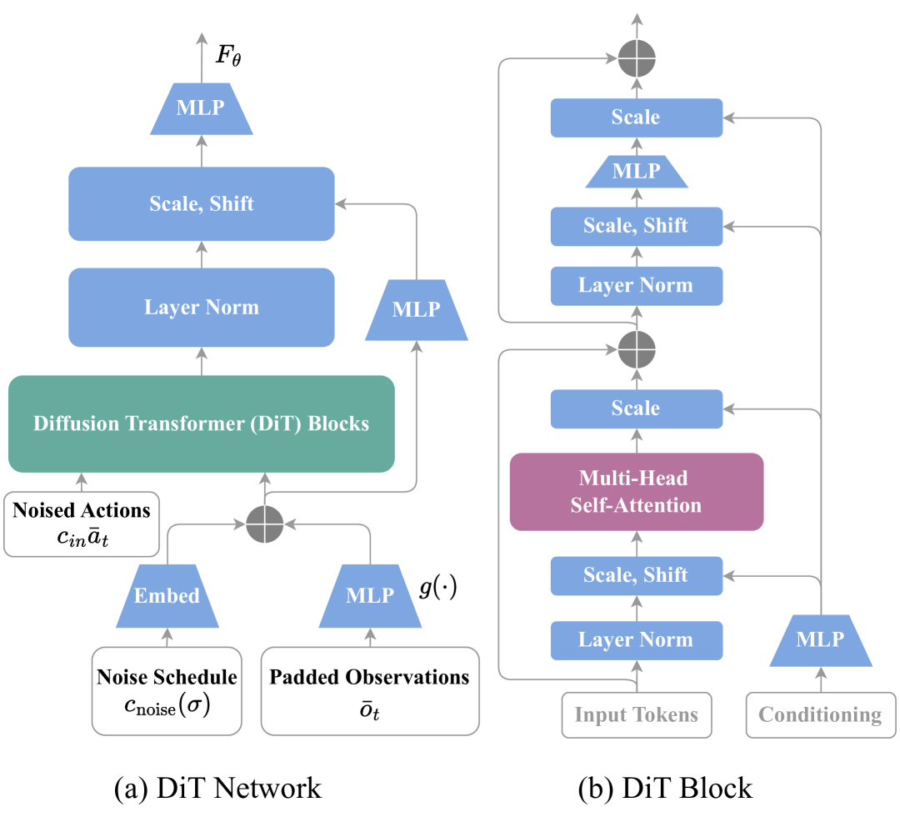
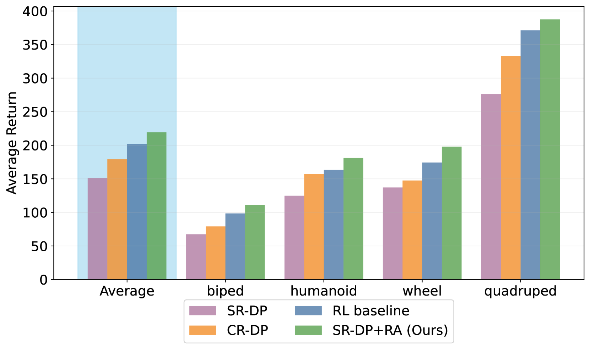
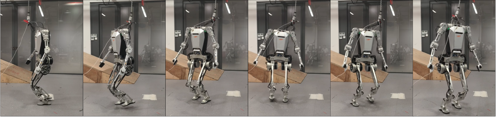
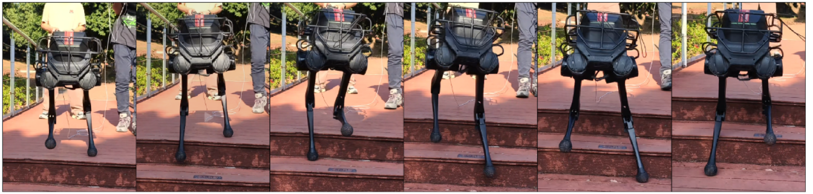
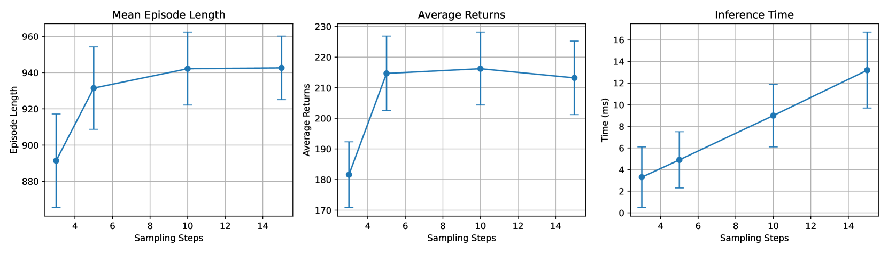
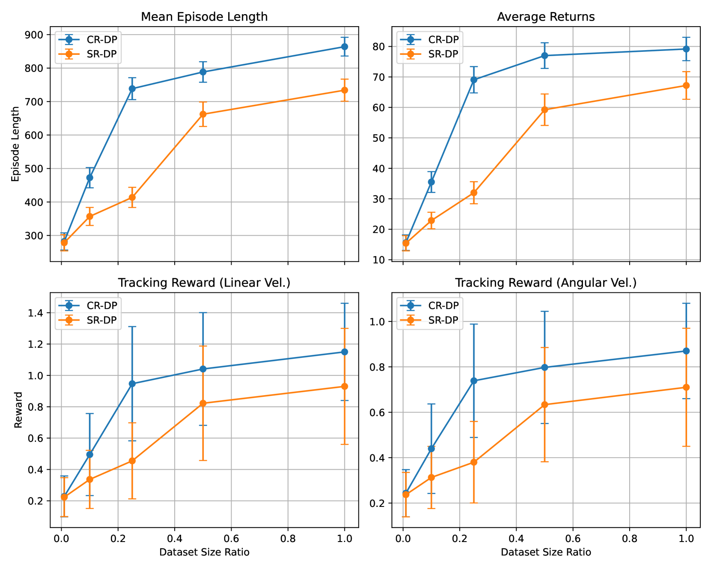
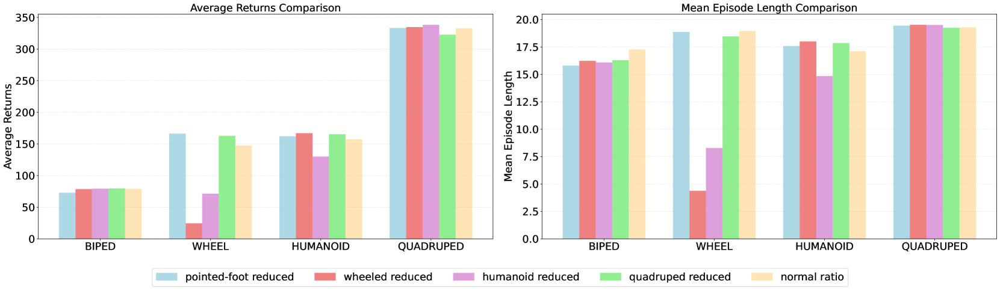

# 论文总结：Multi-Loco: Unifying Multi-Embodiment Legged Locomotion via Reinforcement Learning Augmented Diffusion

## 1. 这个工作解决了一个什么问题？

**核心问题**：如何将运动控制策略泛化到具有不同形态学的多足机器人上。

由于不同机器人在观察/动作维度和系统动力学上的差异，现有方法通常需要为每种形态单独训练策略，导致：
- 知识无法复用
- 平台特定工程量大
- 数据孤岛问题

本文提出的 Multi-Loco 框架旨在通过一个统一的策略来控制多种形态的足式机器人（双足、轮式双足、人形、四足）。

## 2. What / Who / How / Why

| 要素 | 内容 |
|------|------|
| **What** | 提出 Multi-Loco 框架，结合扩散模型和残差强化学习策略，实现跨形态足式机器人运动控制 |
| **Who** | Shunpeng Yang, Zhen Fu 等（南方科技大学、Notre Dame 大学、浙江大学-UIUC 联合学院、LimX Dynamics） |
| **How** | 使用形态无关的扩散模型学习跨 embodiment 的运动模式，通过共享的残差 RL 策略 refinement |
| **Why** | 扩散模型具有多模态建模能力，适合捕捉不同机器人的运动模式；残差策略弥补 sim2real 差距 |

## 3. 之前的工作及局限性

### 相关工作：

1. **强化学习在足式运动控制**（RL for legged locomotion）
   - PPO 等方法在单机器人上效果良好
   - 但需要针对每种形态单独训练

2. **跨形态学习**（Cross-embodiment learning）
   - 主要在机器人操作任务领域
   - 难以处理运动控制中动力学差异

3. **扩散模型在机器人学中的应用**
   - 已有工作用于操作任务
   - 运动控制领域应用较少

### 局限性：
- 运动控制受机器人动力学和环境交互影响大
- 观察/动作空间维度差异带来模型设计复杂度
- sim2real 差距在实际部署中突出

## 4. 方法详解（重点）

### 4.1 核心算法

**整体框架**：扩散模型 + 残差 RL 策略

1. **扩散模型**（Diffusion Model）
   - 学习形态不变的运动模式
   - 输入：跨 embodiment 的观察数据
   - 输出：基础动作建议

2. **残差策略**（Residual Policy）
   - 共享给所有形态
   - 细化扩散模型的输出
   - 增强任务特定性能和 sim2real 迁移

### 4.2 模型架构

#### 4.2.1 维度对齐

使用零填充（zero padding）对齐不同形态的观察和动作空间：

$$\text{dim}(\bar{O}) = \max_{m} \text{dim}(O_m), \quad \text{dim}(\bar{A}) = \max_{m} \text{dim}(A_m)$$

其中 $O_m$ 和 $A_m$ 分别是第 $m$ 种形态的观察和动作空间。

- 使用 Masked Score Matching 处理填充维度：
$$\mathbb{E}_{\bar{a} \sim \mu} \mathbb{E}_{n \sim \mathcal{N}_\sigma}[\lambda(\sigma) \| b \odot D_\theta(b \odot (\bar{a} + n), \bar{o}, \sigma) - \bar{a} \|^2]$$

其中 $b$ 是二进制 mask，$\odot$ 表示元素级乘法。

#### 4.2.2 扩散模型（EDM）

使用 Elucidated Diffusion Model (EDM)，去噪网络形式为：

$$D_\theta(\hat{x}, \sigma) = c_{skip}(\sigma)\hat{x} + c_{out}(\sigma)F_\theta(c_{in}(\sigma)\hat{x}, c_{noise}(\sigma))$$

其中参数设置为：
$$c_{noise}(\sigma) = \ln(\sigma)/4, \quad c_{in}(\sigma) = 1/\sqrt{\sigma^2_x + \sigma^2}, \quad c_{skip}(\sigma) = \sigma^2_x / (\sigma^2_x + \sigma^2)$$

反向时间 ODE：
$$\frac{d\bar{t}}{dt} = \bar{t} - D_\theta(\bar{t}, \sigma)$$

- 使用 DDIM 采样，推理时只需求解 10-15 步

### 4.3 训练策略

#### 4.3.1 扩散模型预训练

1. **扩散模型预训练**
   - 使用跨 embodiment 数据集
   - 学习通用的运动模式
   - 损失函数包含 masked denoising

2. **残差策略微调**
   - 使用 PPO 算法
   - 多 critic 架构
   - 任务感知奖励设计

#### 4.3.2 残差策略

最终动作为扩散模型输出加上残差：
$$a_t = a^{prior}_t + \Delta a_t$$

其中残差策略 $\pi_\theta(\Delta a|\bar{o}, \bar{a}^{prior})$ 通过 PPO 训练。

#### 4.3.3 奖励函数

跟踪奖励：
$$r_{vel} = \exp(-\|v^{des}_b - v_b\| \cdot \sigma)$$
$$r_{ang} = \exp(-\|\Omega^{des}_b - \Omega\| \cdot \sigma)$$
$$r_{height} = \exp(-\|h^{des} - h\|)$$
$$r_{orient} = \exp(-\|\theta^{des}_b - \theta_b\| \cdot 10)$$

其他奖励：
$$r_{contact} = \text{clip}(\|F_l\|^2 + \|F_r\|^2 - F_{max})$$
$$r_{foot} = \text{clip}(d_{min} - d_{foot})$$
$$r_{residual} = \alpha \|\Delta a\|_1$$

### 4.4 创新点

1. **生成式模型 + RL 的结合**
   - 扩散模型提供先验，RL 细化
   - 兼具泛化能力和任务适应性

2. **形态无关的策略设计**
   - 单一策略控制多种形态机器人
   - 零填充 + masked training 解决空间对齐

3. **共享残差策略**
   - 跨形态共享，无需微调
   - 有效缩小 sim2real 差距

## 5. 实验结果

### 实验设置：
- **平台**：4 种足式机器人（双足、轮式双足、人形、四足）
- **环境**：仿真 + 真实世界
- **对比方法**：标准 PPO（高斯策略）

### 主要结果：
- **平均 return 提升 10.35%**
- **轮式双足任务提升最高达 13.57%**
- 在多种非平坦地形（草地、斜坡、楼梯、碎石路）上验证

### 消融实验：

- 验证了跨 embodiment 学习的效果
- 共享残差策略的有效性

### 真实部署：

- 在 4 种机器人平台上成功部署
- 展示了策略的鲁棒性和控制能力

## 6. 总结与思考

### 总结：
- 提出了 Multi-Loco 框架，成功实现跨形态足式机器人统一控制
- 扩散模型 + 残差 RL 的组合设计兼顾泛化性与任务性能
- 实验验证了在仿真和真实环境中的有效性

### 局限性与未来工作：
- 目前仅在 4 种平台上验证
- 形态差异可能还有优化空间
- 可探索更多形态（如蛇形、飞行器）

### 思考：
- 跨形态学习是机器人泛化的重要方向
- 生成式模型（扩散）提供了一种优雅的知识复用方式
- RL 残差连接是解决 sim2real 差距的有效手段
