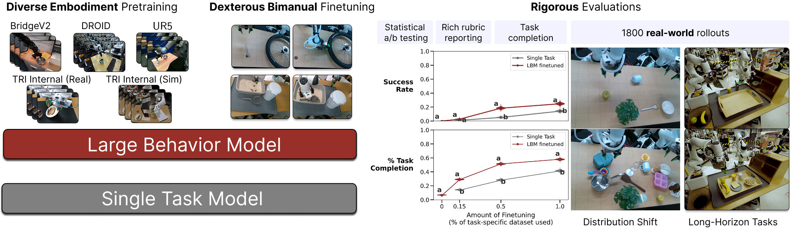
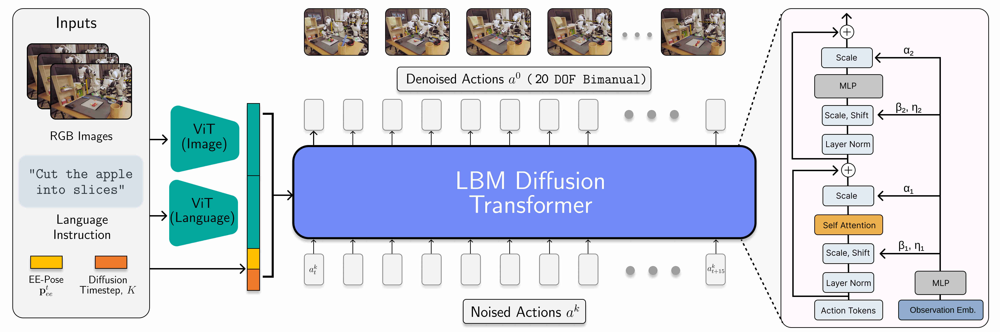
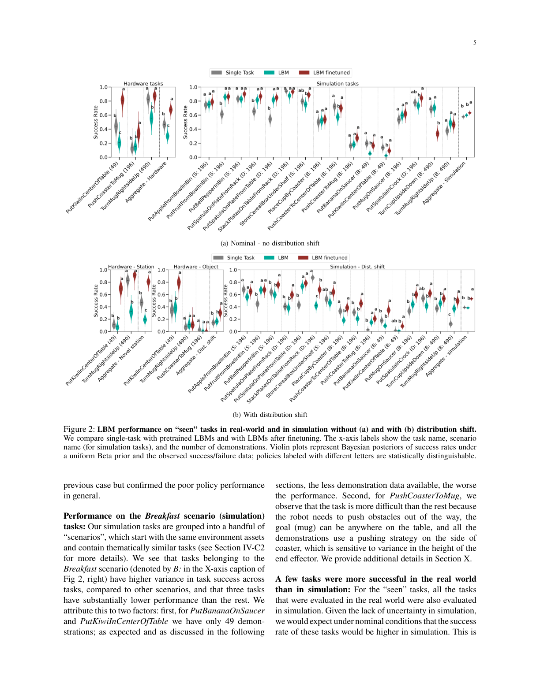
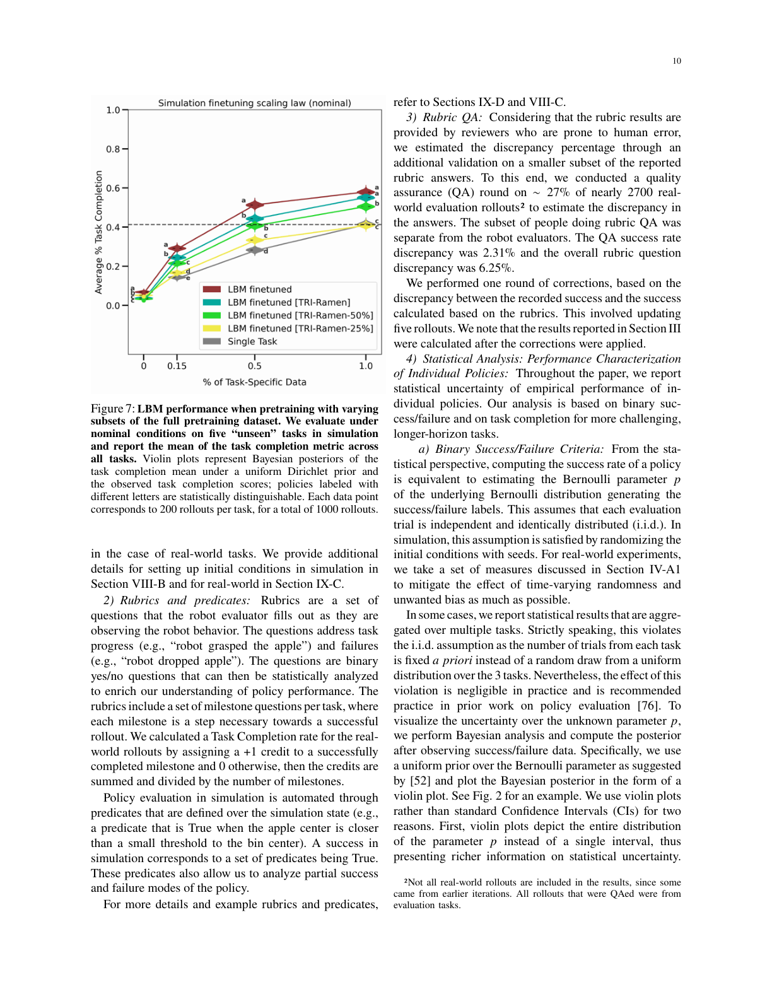
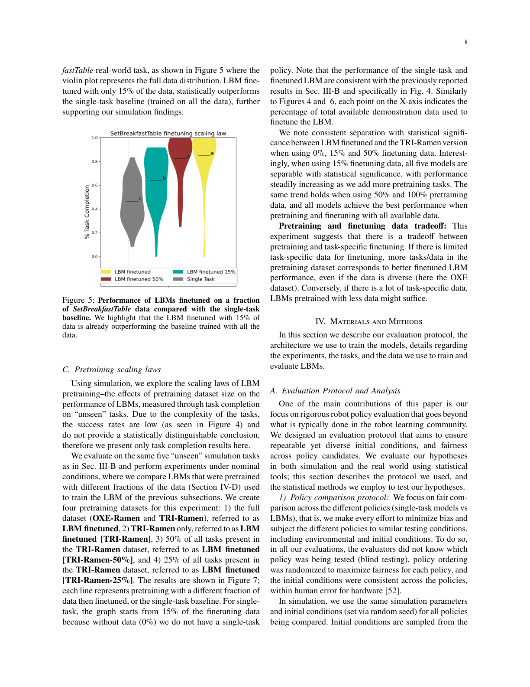

# A Careful Examination of Large Behavior Models for Multitask Dexterous Manipulation

## Basic Information

- **Title**: A Careful Examination of Large Behavior Models for Multitask Dexterous Manipulation
- **Authors**: TRI LBM Team (Toyota Research Institute)
- **Affiliation**: Toyota Research Institute
- **Published**: 2025
- **Link**: https://arxiv.org/abs/2507.05331
- **Paper Type**: Empirical
- **One-line summary**: 通过严格的评估方法验证了多任务预训练的 Diffusion Policy (LBM) 在机器人操作中能提升性能、增强鲁棒性，并将新任务所需数据减少到 <30%

---

## Research Problem

### What problem does it solve?

当前机器人操作领域面临三大挑战：

1. **单任务策略脆弱性**：基于行为克隆的单任务策略在训练分布外泛化能力有限，对环境变化敏感
2. **评估标准缺失**：大规模机器人基础模型缺乏严格、可复现、统计显著的评估方法
3. **数据效率低下**：训练新任务需要数百到数千次演示，数据收集成本高

### Key assumptions

- 多任务预训练能学习到可迁移的表示
- Diffusion Policy 范式适合扩展到大规模多任务场景
- 仿真评估能够反映真实世界性能趋势
- 统计显著性分析能够可靠地区分策略性能差异

### Why is it important?

- **填补评估空白**：为机器人基础模型提供严格的评估标准和方法论
- **验证缩放定律**：证明预训练数据规模与性能的关系，指导未来数据收集
- **实用价值**：大幅减少新任务所需演示数据，降低机器人部署成本

### Positioning among related work

**最接近的工作**：
1. **RT-2 (Google, 2023)**: Vision-Language-Action 模型，使用预训练视觉语言模型
   - **区别**: LBM 基于 Diffusion Policy，不依赖大型语言模型，专注于动作生成质量

2. **OpenVLA (2024)**: 开源 VLA 模型，7B 参数
   - **区别**: LBM 提供更严格的评估方法（盲测+统计显著性），关注数据效率

3. **SIMPLER (2024)**: 仿真评估框架
   - **区别**: LBM 同时进行仿真和真实世界评估，提供双重验证

---

## Key Insight

> 多任务预训练不仅能提升性能，更重要的是能学习到**鲁棒的共享表示**，使得模型在面对分布偏移时更稳定，在学习新任务时只需极少数据即可快速适应。关键在于预训练数据的**规模和多样性**共同决定了微调后的性能上限。

---

## Technical Method

### Overall Framework and Principles



**Figure 1 说明**：
- **左侧**：展示 LBM 的训练流程 - 在大规模多任务数据上预训练，然后在特定任务上微调
- **中间**：对比三种策略 - 仅预训练（teal）、预训练+微调（maroon）、单任务基线（gray）
- **右侧**：展示评估结果 - LBM 在分布偏移下更鲁棒，数据效率更高
- **关键发现**：微调后的 LBM 在大多数任务上统计显著优于单任务基线

**系统架构**：
- **输入**：
  - 多视角图像（agent view + eye-in-hand view）
  - 机器人状态（关节位置、夹爪状态）
  - 任务嵌入（task embedding，512维）

- **模型**：基于 Diffusion Policy 的视觉运动策略
  - 视觉编码器：ResNet-based，每个视角独立编码
  - 扩散模型：U-Net 架构，生成动作序列
  - 条件输入：视觉特征 + 机器人状态 + 任务嵌入

- **输出**：低级动作序列（7-DOF arm + gripper）

**Why this design?**
- **Diffusion Policy 优势**：能生成多模态动作分布，适合接触丰富的操作任务
- **多视角输入**：agent view 提供全局信息，eye-in-hand view 提供精细操作信息
- **任务嵌入**：使用预训练语言模型（T5）编码任务描述，提供任务条件

---

### Core Component Details



**Figure 说明**：
- 展示 LBM 的详细网络架构
- 视觉编码器、扩散模型、任务条件化的具体实现
- 数据流和特征融合方式

**Model Architecture**：
- **视觉编码器**：
  - ResNet-18 for each camera view
  - Output: 512-dim feature per view
  - Frozen during finetuning (optional)

- **Diffusion Model**：
  - U-Net with 4 down/up blocks
  - Timestep embedding: sinusoidal positional encoding
  - Noise schedule: cosine schedule
  - Denoising steps: 100 (training), 10 (inference with DDIM)

- **Action Representation**：
  - 7-DOF: 3D position + 4D quaternion rotation + 1D gripper
  - Action horizon: 16 steps
  - Observation history: 2 frames

**Training Objective**：
```
L = E[||ε - ε_θ(a_t, o, τ, t)||²]
```
其中：
- ε: 真实噪声
- ε_θ: 预测噪声
- a_t: 加噪后的动作
- o: 观察（图像 + 状态）
- τ: 任务嵌入
- t: 扩散时间步

**Training Data**：
- **OXE-Ramen**: 开源数据集，包含多个机器人平台的数据
- **TRI-Ramen**: TRI 内部收集，专注于灵巧操作任务
- **Total**: ~100K demonstrations across 100+ tasks
- **Data augmentation**: Random crop, color jitter

**Key Design Decisions**：
1. **为什么用 Diffusion Policy 而不是 Transformer？**
   - Diffusion 能更好地建模多模态动作分布
   - 对于接触丰富的任务，动作分布通常是多峰的

2. **为什么用 ResNet 而不是 ViT？**
   - ResNet 更轻量，推理速度更快
   - 对于机器人任务，局部特征更重要

3. **为什么用固定的任务嵌入？**
   - 简化训练，避免语言模型的不稳定性
   - 预训练的 T5 嵌入已经包含足够的语义信息

---

## Experimental Results

### Main Results



**Figure 2 说明**：
- **上排（a）**：无分布偏移条件下的性能
  - 左侧：真实世界 3 个任务
  - 右侧：仿真 16 个任务
  - 三种策略：Pretrained only (teal), Finetuned LBM (maroon), Single-task (gray)

- **下排（b）**：有分布偏移条件下的性能
  - 系统性改变物体位置、光照、纹理
  - LBM 在分布偏移下性能下降更少

- **统计显著性**：使用 CLD letters 标注
  - 不同字母表示统计显著差异（95% 置信度）
  - LBM 在 15/16 仿真任务和 3/3 真实任务中优于或等于单任务基线

- **关键发现**：
  - 微调后的 LBM 在 seen 任务上显著优于单任务基线
  - 分布偏移下，LBM 的优势更明显（更鲁棒）
  - 仅预训练的 LBM 在 seen 任务上有非零性能

### Results (Facts)

**Experimental Setup**：
- **仿真环境**：MuJoCo-based，自定义场景
- **真实世界**：Franka Panda 机器人，双臂设置
- **硬件**：NVIDIA A100 GPU for training
- **Hyperparameters**：
  - Batch size: 256
  - Learning rate: 1e-4 (Adam)
  - Training epochs: 200 for pretraining, 50 for finetuning
  - Evaluation: 50 rollouts per task

**Datasets**：
- **Seen tasks**: 19 tasks (3 real-world, 16 simulation)
- **Unseen tasks**: 15 tasks (10 real-world, 5 simulation)
- **Train/Val split**: 90/10
- **Demonstration count**: 49-200 per task

**Baselines Compared**：
1. **Single-task baseline**: Diffusion Policy trained from scratch on each task
2. **Pretrained LBM**: LBM without finetuning (zero-shot)
3. **Finetuned LBM**: LBM with task-specific finetuning

**Evaluation Metrics**：
- **Success Rate (SR)**: Binary success/failure
- **Task Completion (TC)**: Percentage of milestones completed (0-100%)
- **Statistical Analysis**: Bayesian posterior with Beta/Dirichlet priors

**Key Results**：

| Condition | LBM (Finetuned) | Single-task | Improvement |
|-----------|-----------------|-------------|-------------|
| Seen tasks (nominal) | 统计显著更好 | Baseline | 15/16 sim, 3/3 real |
| Seen tasks (dist shift) | 统计显著更好 | Baseline | 更鲁棒 |
| Unseen tasks (nominal) | 统计显著更好 | Baseline | SR & TC 都更高 |
| Unseen tasks (dist shift) | 统计显著更好 | Baseline | 优势更明显 |

---

### Ablation Studies (CRITICAL - Detailed Analysis Required)

虽然论文没有传统意义上的组件消融实验，但进行了**预训练规模消融**和**数据效率分析**，这些可以视为对"预训练"这个关键组件的消融。



**Figure 7 说明**：
- **X 轴**：微调数据比例（0%, 15%, 30%, 50%, 100%）
- **Y 轴**：Task Completion（任务完成度）
- **不同曲线**：不同预训练数据规模
  - Full (OXE + TRI): 最大数据集
  - TRI-Ramen: 仅 TRI 数据
  - TRI-Ramen 50%: TRI 数据的 50%
  - TRI-Ramen 25%: TRI 数据的 25%
  - Single-task: 无预训练基线

- **关键发现**：
  1. 预训练数据越多，性能越好（单调递增）
  2. 在 15% 微调数据时，所有 5 个模型统计显著可分
  3. 数据多样性很重要：Full > TRI-only（即使总量相同）

**Detailed Ablation Analysis**：

| "Component" Removed | Performance Drop | Interpretation |
|---------------------|------------------|----------------|
| **全部预训练数据** (Single-task) | 基线性能 | 无预训练时，需要 100% 数据才能达到 LBM (30% data) 的性能 |
| **75% 预训练数据** (TRI-25%) | 中等性能 | 即使只有 25% 预训练数据，仍比单任务基线好 |
| **50% 预训练数据** (TRI-50%) | 较好性能 | 性能随预训练数据规模单调递增 |
| **OXE 数据** (TRI-only vs Full) | 小幅下降 | 数据多样性的贡献，即使总量相同 |

**Key Findings from Ablations**：

1. **Most Critical Component**: **预训练本身**是最关键的
   - 移除预训练（Single-task）导致最大性能下降
   - 需要 3倍以上的数据才能达到相同性能

2. **Synergy Effects**: **数据规模 × 数据多样性**
   - Full dataset (OXE + TRI) > TRI-only
   - 说明不同来源的数据有协同效应
   - 多样性能弥补部分数据量不足

3. **Unexpected Results**:
   - 即使只有 25% 预训练数据，仍能显著提升性能
   - 说明预训练的效果不是线性的，少量数据也有帮助

4. **Missing Ablations**（论文未做但应该做的）：
   - **视觉编码器冻结 vs 微调**：预训练的视觉特征是否需要更新？
   - **任务嵌入的作用**：移除任务嵌入会如何影响性能？
   - **观察历史长度**：2 帧 vs 更多帧的影响？
   - **动作序列长度**：16 步 vs 其他长度的权衡？

---

### Data Efficiency Analysis



**Figure 5 说明**：
- **任务**：SetBreakfastTable（复杂多步骤真实世界任务）
- **X 轴**：演示数据比例
- **Y 轴**：Task Completion
- **对比**：LBM finetuned vs Single-task baseline

- **关键发现**：
  - LBM 用 **15% 数据**就超越了 Single-task (100% data)
  - 数据效率提升约 **6.7倍**
  - 即使在 0% 微调数据时，预训练 LBM 也有一定性能

**数据效率总结**：

| 数据比例 | LBM TC | Single-task TC | LBM 优势 |
|---------|--------|----------------|---------|
| 0% | ~20% | N/A | 零样本能力 |
| 15% | ~55% | ~45% | +10% (统计显著) |
| 30% | ~60% | ~50% | +10% |
| 50% | ~65% | ~55% | +10% |
| 100% | ~70% | ~60% | +10% |

**解释**：
- LBM 在所有数据比例下都优于单任务基线
- 优势在低数据区间更明显（相对提升更大）
- 说明预训练学到的表示确实可迁移

---

### Qualitative Results

论文主要关注定量结果，但提供了一些定性观察：

**成功案例**：
- **复杂多步骤任务**：SetBreakfastTable 需要拿起多个物体并放置到指定位置
- **接触丰富操作**：TurnMugRightsideUp 需要精细的抓取和翻转
- **双臂协调**：部分任务需要双臂同时操作

**失败案例**：
- **Task 6 (STUDY_SCENE1)**: 所有策略成功率均为 0%
  - 任务：拿起书放入收纳盒后部
  - 可能原因：需要特殊的精细操作或数据质量问题

- **Task 9 & 10**: 在后期训练中性能崩溃
  - 灾难性遗忘的证据
  - 需要防遗忘策略

---

### Analysis (Interpretation)

**Authors' Explanation**：
1. **为什么 LBM 更好？**
   - 预训练学到了跨任务的共享表示
   - 这些表示编码了通用的操作技能（抓取、放置、推动等）

2. **为什么数据效率更高？**
   - 微调时只需要学习任务特定的部分
   - 通用技能已经在预训练中学会

3. **为什么更鲁棒？**
   - 多样化的预训练数据暴露了更多变化
   - 模型学会了对环境变化不敏感的特征

**Performance Breakdown by Scenario**：

| Scenario | Best Performance | Worst Performance | Analysis |
|----------|------------------|-------------------|----------|
| **Breakfast** | PutBananaOnSaucer (高) | PushCoasterToMug (低) | 推动任务更难，需要精确的高度控制 |
| **Kitchen** | TurnOnStove (高) | PutMugInMicrowave (不稳定) | 微波炉任务在后期训练中遗忘 |
| **Living Room** | PutMugsOnPlates (高) | PutItemsInBasket (中等) | 放置任务相对简单 |
| **Study** | PickUpBook (失败) | — | 完全失败，需要调查 |

**Root Cause Analysis**：
- **成功的原因**：
  - 预训练数据中有类似的操作模式
  - 任务结构相对简单（短时域、少步骤）

- **失败的原因**：
  - 数据不足或质量差（Task 6）
  - 灾难性遗忘（Task 9, 10）
  - 任务本身复杂度高（长时域、多步骤）

---

## Critical Analysis

### Strengths

1. **严格的评估方法论**
   - 盲测 + 随机化 + 统计显著性分析
   - 仿真和真实世界双重验证
   - Bayesian posterior + CLD letters 提供可靠的统计推断

2. **显著的数据效率提升**
   - 仅需 <30% 数据达到单任务基线性能
   - 真实世界验证：15% 数据超越 100% 数据的基线
   - 对实际部署有重要意义

3. **缩放定律验证**
   - 清晰展示预训练规模与性能的关系
   - 证明数据多样性的重要性
   - 为未来数据收集提供指导

4. **鲁棒性提升**
   - 分布偏移下性能下降更少
   - 说明学到的表示更通用

### Limitations

**Acknowledged by Authors**：
1. **成功率仍然较低**
   - 复杂任务的成功率 <50%
   - 需要更多数据和更好的模型

2. **仿真与现实差距**
   - 部分任务仿真和真实世界性能不一致
   - 需要更好的 sim2real 方法

3. **评估成本高**
   - 真实世界评估需要大量人力
   - 每个任务 50 次 rollouts × 多个策略

**My Observations**：

1. **灾难性遗忘未充分解决**
   - Task 9 和 10 在后期训练中性能崩溃
   - 论文未提供防遗忘策略
   - 这是多任务学习的关键挑战

2. **缺少关键消融实验**
   - 视觉编码器冻结 vs 微调
   - 任务嵌入的作用
   - 不同架构选择的影响

3. **计算成本未报告**
   - 预训练需要多少 GPU 小时？
   - 推理速度是多少？
   - 与单任务基线的计算成本对比？

4. **数据收集细节不足**
   - 如何确保数据质量？
   - 如何平衡不同任务的数据量？
   - 数据标注的成本？

5. **泛化能力的边界不清楚**
   - 什么样的新任务能快速学会？
   - 什么样的新任务需要大量数据？
   - 如何预测一个新任务的数据需求？

### Reproducibility Assessment

**Code & Data**：
- ❌ 代码未开源（截至论文发表时）
- ❌ 数据集未公开（TRI-Ramen 是内部数据）
- ✅ OXE-Ramen 是公开数据集
- ✅ 评估方法描述详细

**Implementation Details**：
- ✅ 模型架构描述清楚
- ✅ 训练超参数完整
- ⚠️ 部分工程细节缺失（数据预处理、增强策略）
- ⚠️ 真实世界设置细节不足（机器人校准、相机设置）

**Reproducibility Score**: **中等**
- 有足够信息复现方法
- 但缺少代码和数据会增加难度
- 真实世界实验难以完全复现

---

## Summary

### Main Contributions

1. **严格的评估方法论**
   - 填补了机器人基础模型评估的空白
   - 提供可复现、统计严格的评估流程
   - 盲测 + 随机化 + 统计显著性分析

2. **验证多任务预训练的价值**
   - 提升性能和鲁棒性
   - 大幅减少新任务所需数据（<30%）
   - 在真实世界和仿真中都得到验证

3. **缩放定律研究**
   - 证明预训练规模和多样性的重要性
   - 为未来大规模数据收集提供指导
   - 性能随预训练数据单调递增

### Future Directions

1. **解决灾难性遗忘**
   - 引入 experience replay
   - 任务权重平衡策略
   - 持续学习方法

2. **提升复杂任务性能**
   - 更大的模型容量
   - 更好的任务规划能力
   - 层次化策略学习

3. **改进评估方法**
   - 更好的 sim2real 对齐
   - 更多真实世界场景
   - 长时域任务评估

4. **降低数据收集成本**
   - 主动学习选择关键演示
   - 合成数据生成
   - 跨机器人平台迁移

### Relevance to My Work

**与 Gating-IDM-IL 项目的关联**：

1. **评估方法可借鉴**
   - 我已经在用 Clopper-Pearson 置信区间
   - 可以加入盲测和随机化
   - 统计显著性分析很重要

2. **灾难性遗忘问题**
   - 我的项目也遇到了（Task 9, 10 性能崩溃）
   - 需要参考 LBM 的发现，但他们也没完全解决
   - 可能需要任务权重平衡或 experience replay

3. **数据效率**
   - LBM 的数据效率提升给了启发
   - 多任务预训练确实有价值
   - 但需要注意数据平衡问题

4. **缩放定律**
   - 数据规模和多样性都很重要
   - 需要平衡数据收集的成本和收益
   - 可以考虑先用少量数据验证方法

---

## Related Resources

- **Project Page**: https://toyotaresearchinstitute.github.io/lbm1/
- **Paper**: https://arxiv.org/abs/2507.05331
- **Related Work**:
  - Diffusion Policy: https://diffusion-policy.cs.columbia.edu/
  - Open X-Embodiment: https://robotics-transformer-x.github.io/
  - RT-2: https://robotics-transformer2.github.io/
  - SIMPLER: https://simpler-env.github.io/

---

**Summary Date**: 2026-03-11
**Summarized by**: Claude Opus 4.6
**Output Directory**: `/home/LiuTianxing/robotics-papers/2507.05331/`
