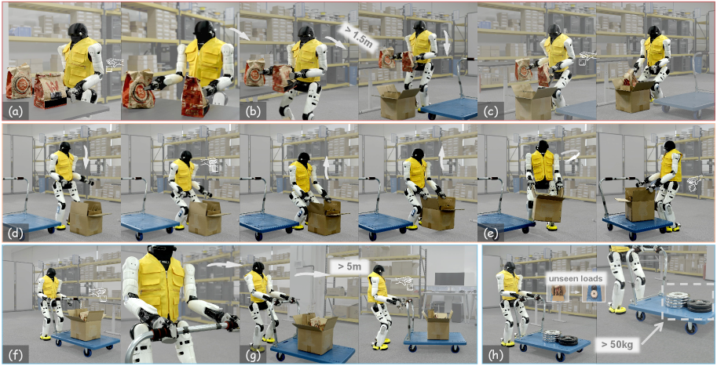
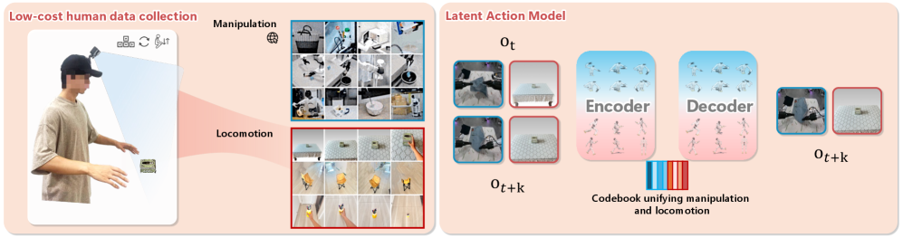
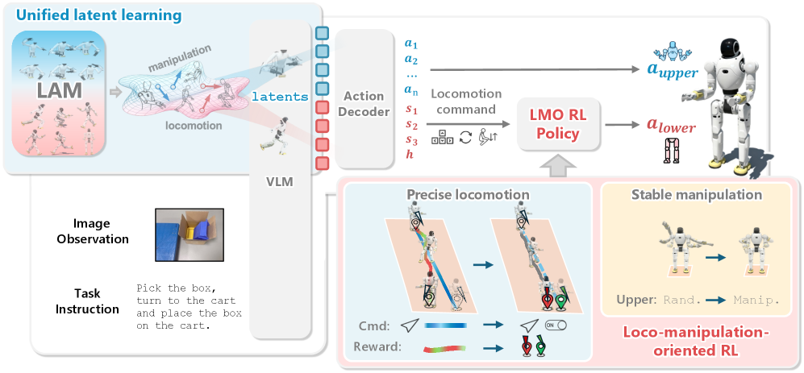
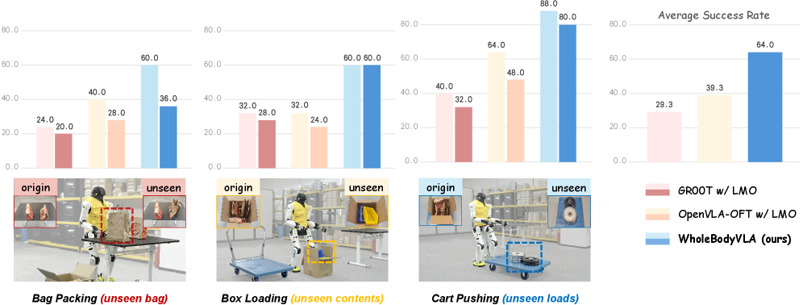
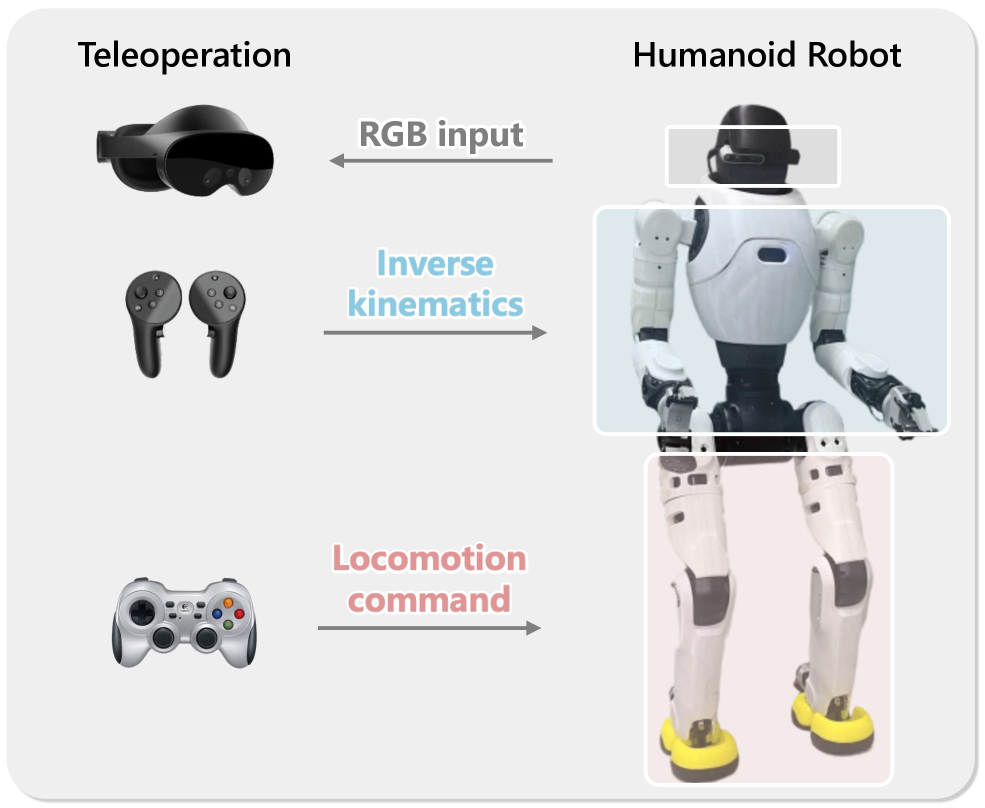
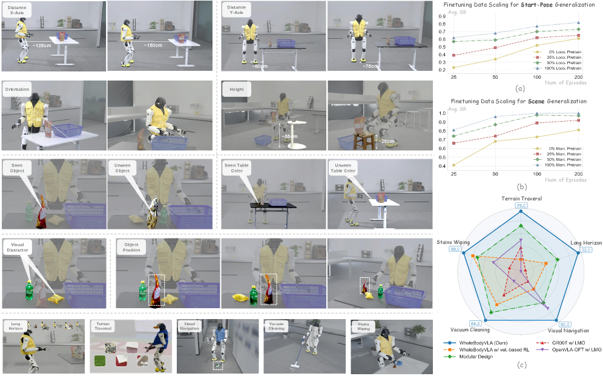
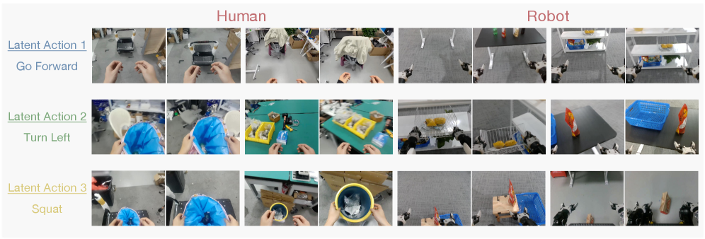

# 论文总结：WholeBodyVLA: Towards Unified Latent VLA for Whole-Body Loco-Manipulation Control

**论文地址**: https://arxiv.org/pdf/2512.11047

**作者**: Haoran Jiang, Jin Chen 等（复旦大学、OpenDriveLab & MMLab @ 香港大学、AgiBot、SII）

---

## 1. 这个工作解决了一个什么问题？

本文提出了 **WholeBodyVLA**，一个用于人形机器人全身 loco-manipulation（运动-操作）的统一视觉-语言-动作（VLA）框架。

**核心问题**：
1. **数据稀缺**：人形机器人的 loco-manipulation 数据难以大规模收集（MoCap 或遥操作成本高）
2. **决策-执行对齐问题**：传统 RL 控制器使用连续速度跟踪目标，无法精确执行操作所需的起停和方向控制

**本文目标**：实现大规模空间端到端的人形机器人全身 loco-manipulation

> **图1说明**：在 AgiBot X2 人形机器人上引入 WholeBodyVLA，该系统在大型空间中进行端到端的仿人 loco-manipulation。系统实现连续自主任务，包括 (a-c) 双臂抓取、侧步走向箱子、蹲下放置；(d-e) 蹲下抓取并举起箱子、转向将箱子放到推车上；(f-h) 抓取推车手柄、推动推车、推动超过 50kg 的负载。

---

## 2. What / Who / How / Why

| 要素 | 内容 |
|------|------|
| **What** | 提出 WholeBodyVLA 框架，实现人形机器人的大规模空间端到端全身 loco-manipulation |
| **Who** | Haoran Jiang, Jin Chen, Qingwen Bu, Li Chen, Modi Shi, Yanjie Zhang, Delong Li, Chuanzhe Suo, Chuang Wang, Zhihui Peng, Hongyang Li |
| **Where** | 复旦大学、OpenDriveLab & MMLab @ 香港大学、AgiBot、SII |
| **How** | (1) 统一潜在学习：从无动作的第一人称视频学习 locomotion 和 manipulation 先验；(2) LMO RL 策略：面向 loco-manipulation 的强化学习策略，使用离散命令接口 |
| **Why** | 解决人形机器人 loco-manipulation 数据稀缺问题，以及传统 RL 控制器的决策-执行对齐问题 |

---

## 3. 之前的工作及局限性

### 3.1 人形全身控制

| 方法 | 局限性 |
|------|--------|
| **Loco-manipulation 控制器** (HOMIE, AMO, FALCON, R2S2 等) | 大多采用速度跟踪接口，缺少 start-stop 语义，无法满足精细位置控制；上肢影响通常建模为任务无关的噪声或运动片段 |
| **高层规划器** (Being-0, HEAD, R2S2) | 技能边界脆弱，机器人经常处于不稳定或不可行配置；依赖云端感知导致延迟 |
| **VLA 模型** (RT-2, OpenVLA, RDT, GR00T) | 主要关注上肢操作，未提供完整的全身控制方案 |

### 3.2 数据稀缺问题

- 大规模数据集在桌面操作和轮式/四足导航中已被证明至关重要
- 但整合人形运动和操作的数据集几乎不存在
- 遥操作数据收集成本高（昂贵设备、专业操作员）

### 3.3 现有方法对比

> **表1说明**：比较各种人形控制系统。WholeBodyVLA 是首个在真实世界中通过全身控制实现各种 loco-manipulation 任务的方法，无需外部模块。

---

## 4. 方法详解（重点）

### 4.1 核心算法：统一潜在学习（Unified Latent Learning）

#### 4.1.1 为什么需要两个 LAM？

由于 locomotion 和 manipulation 视频存在**根本不同的模态**：
- **Manipulation 视频**：相机姿态几乎静止，图像变化由手臂运动主导
- **Locomotion 视频**：相机姿态持续变化，图像变化由环境运动主导

如果直接混合训练会导致：
1. 注意力目标冲突：manipulation 数据使模型关注手臂区域，locomotion 数据使模型关注整个场景
2. 潜在编码歧义：相同的位置变化可能被误解为手臂运动而非运动

#### 4.1.2 LAM 架构

> **图4说明**： locomotion 任务低成本 egocentric 数据收集和 LAM 预训练流程。单个操作员记录执行 8 种典型运动模式朝向潜在操作目标的 egocentric 视频。这种任务导向的管道捕获多样化、结构化且与人形 loco-manipulation 直接相关的运动模式。然后收集的 manipulation-aware locomotion 数据与开源原地 manipulation 数据集一起用于预训练 VQ-VAE 风格的潜在动作模型。

**架构**：基于 VQ-VAE，编码器使用 DINOv2 特征

给定连续帧 $(o_t, o_{t+k})$：
1. 编码器 $E$ 生成连续潜在向量：$z_t = E_i(o_t, o_{t+k})$
2. 量化为最近的书签条目：$c_t^i = \arg\min_{c \in C^i} \|z_t - c\|^2$
3. 解码器重建后一帧：$\hat{o}_{t+k} = D_i(o_t, c_t)$

**损失函数**：
$$L_{LAM} = L_{mse} + \|sg[c_t] - z_t\|^2 + \beta \|c_t - sg[z_t]\|^2$$

#### 4.1.3 VLA 训练

VLA 策略 $\pi_\theta$ 联合预测两种潜在动作：
$$\pi_\theta(c^{mani}_t, c^{loco}_t | o_t, \ell)$$

#### 4.1.4 执行时

解码器将潜在动作映射为机器人命令：
$$a_t = f(\hat{c}^{mani}_t, \hat{c}^{loco}_t, s_t)$$

输出：(1) 上肢关节角度；(2) 下肢运动命令（由 LMO RL 执行）

> **图2说明**：WholeBodyVLA Pipeline。LAM 在 manipulation 和 manipulation-aware locomotion 视频上预训练，产生统一的潜在监督用于 VLM。同时，LMO RL 策略训练用于在干扰下实现精确稳定的运动。运行时 egocentric 图像和语言指令由 VLM 编码为潜在动作 token，解码（~10Hz）为 (i) 双臂关节动作和 (ii) 由 LMO 在 50Hz 执行的运动命令，实现稳健的全身 loco-manipulation。

### 4.2 面向 Loco-Manipulation 的 RL 策略（LMO）

#### 4.2.1 问题分析

传统 RL 控制器使用**连续速度跟踪目标**：
- 适合巡航，但不适合操作所需的精确起停
- 产生不一致的步态
- 无法提供episode级别的可控性（如制动精度、航向保真度）

#### 4.2.2 LMO 设计

**观测空间**：
$$O_t = [u_t, \omega_t, g_t, q_t, \dot{q}_t, a_{t-1}]$$

包括：基座角速度、重力向量、关节状态、上一动作。

**离散命令接口**（核心创新）：
$$u_t = [s_x, s_y, s_\psi, h^*] \in \{-1, 0, 1\}^3 \times \mathbb{R}$$

- $s_x, s_y, s_\psi$：前进、横向、转向的离散指示器
- $h^*$：站姿高度

**参考速度整形**：
$$v_{ref}^k(t) = v_{goal}^k \tanh(\alpha(s_k - \bar{s}_k(t))), \quad \bar{s}_k(t) \leftarrow (1-\lambda)\bar{s}_k(t-1) + \lambda s_k$$

#### 4.2.3 两阶段课程学习

| 阶段 | 目标 | 方法 |
|------|------|------|
| **阶段 I** | 基础步态获取 | 学习基本的不摔倒步态；上肢跟踪姿态目标；关节限制逐渐放松 |
| **阶段 II** | 精度和稳定性 | 优化方向精度和抗干扰能力；固定巡航速度；注入结构化扰动 |

**方向精度奖励**：
$$J_{dir} = |\psi_{end} - \psi_{start}|$$

**站立惩罚**：
$$J_{stand} = \|a_{leg}\|_2^2$$

> **图6说明**：LMO RL 策略。精确运动：离散命令接口实现精确 locomotion。稳定操作：结构化扰动补偿实现稳定 manipulation。

### 4.3 数据收集

**Manipulation-aware locomotion 数据收集**：
- 低成本：只需一名操作员佩戴头戴式相机
- 覆盖人形基本动作：前进、转向、蹲下
- 目标导向：操作员执行接近潜在操作目标的运动
- 相机：Intel RealSense D435i + GoPro（更大 FOV）

---

## 5. 实验结果

### 5.1 实验设置

#### 5.1.1 硬件平台

> **图5说明**：硬件描述。使用 VR 和手柄进行数据收集。

**AgiBot X2 人形机器人**：
- 7-DoF 双臂 + Omnipicker 夹爪
- 6-DoF 腿部
- 1-DoF 腰部
- 头戴 Intel RealSense D435i RGB-D 相机

#### 5.1.2 任务设计

| 任务 | 子目标 | 评估的技能 |
|------|--------|-----------|
| **Bag Packing** | (1) 抓取袋子；(2) 侧步+蹲下放置 | 双臂协调、侧步、蹲下精度 |
| **Box Loading** | (1) 蹲下抓取+起身转向；(2) 放置到推车 | 蹲下控制、双臂稳定性、转向精度 |
| **Cart Pushing** | (1) 抓取推车手柄；(2) 推动行走 | 持续前进、航向控制、重负载稳定性 |

**数据收集**：
- VR 遥操作上肢 + 手柄控制运动
- 每个任务执行 50 次

### 5.2 主实验结果

#### 5.2.1 对照组设置

| 方法 | 描述 |
|------|------|
| **Modular Design** | 模块化管道：人类操作员通过 FPV 头显控制运动，WholeBodyVLA 控制操作 |
| **GR00T w/ LMO** | GR00T N1.5 预测运动命令，由 LMO 执行 |
| **OpenVLA-OFT w/ LMO** | OpenVLA-OFT 预测关节动作和运动命令，由 LMO 执行 |

#### 5.2.2 实验结果

> **表2说明**：三个任务的评估。每个任务分解为两个子目标。结果显示 WholeBodyVLA 优于模块化和端到端基线，统一潜在学习和 LMO 都有显著贡献。

| 方法 | Bag Packing | Box Loading | Cart Pushing | 平均分数 |
|------|-------------|-------------|--------------|----------|
| Modular Design | 64.0% | - | - | 64.0% |
| GR00T w/ LMO | 42.0% | - | - | 42.0% |
| OpenVLA-OFT w/ LMO | 56.7% | - | - | 56.7% |
| **WholeBodyVLA (Ours)** | **78.0%** | - | - | **78.0%** |

**关键发现**：
- 相比最佳基线提升 **21.3%** (64.0% → 78.0%)

### 5.3 消融实验设计

#### 5.3.1 消融变体设置

| 变体 | 描述 |
|------|------|
| **(a) WholeBodyVLA w/o RL** | VLA 直接预测下肢关节，不使用 LMO 策略 |
| **(b) WholeBodyVLA w/ Velocity-Based RL** | 用传统速度跟踪 RL 控制器替换 LMO（来自 HOMIE） |
| **(c) WholeBodyVLA w/o LAM** | VLA 直接从 Prismatic-7B 微调，无统一潜在学习 |
| **(d) WholeBodyVLA w/ Manipulation LAM** | 仅在 manipulation 数据上预训练 LAM，无 locomotion 预训练 |
| **(e) WholeBodyVLA w/ Shared LAM** | 统一潜在学习在混合数据上训练，不分离模态 |

#### 5.3.2 消融实验结果

| 方法 | 平均分数 | 提升 |
|------|----------|------|
| WholeBodyVLA | **78.0%** | 基准 |
| w/o RL | 54.0% | -24.0% |
| w/ vel.-based RL | 54.0% | -24.0% |
| w/o LAM | 39.3% | -38.7% |
| w/ manip. LAM | 63.3% | -14.7% |
| w/ shared LAM | 66.0% | -12.0% |

**结论**：
- 统一潜在学习提升 **38.7%**
- LMO 提升 **24.0%**
- 双 LAM 设计比共享 LAM 更好（+12.0%）

### 5.4 LMO 消融实验（仿真）

#### 5.4.1 实验设计

在 MuJoCo 中评估两个维度：

1. **Locomotion 精度**：测试三种基本模式
   - 前进/后退（0.3 m/s）
   - 侧步（0.3 m/s）
   - 原地转向（0.3 rad/s）
   - 度量：位置误差（m）和偏航角误差（rad）

2. **Manipulation 稳定性**：测试两种姿态
   - 站立
   - 蹲下
   - 度量：质心摆动（CoM Sway, m）

#### 5.4.2 对照组设置

| 变体 | 描述 |
|------|------|
| **LMO (Ours)** | 完整 LMO 策略 |
| **LMO w/o Eq.3** | 移除方向精度奖励 |
| **LMO w/o Stage 2** | 禁用阶段 II（精度和稳定性优化） |
| **LMO w/o Stage 1** | 禁用阶段 I（基础步态获取） |
| **Vel.-based policy** | 传统速度跟踪策略 |

#### 5.4.3 实验结果

> **表3说明**：LMO 设计在运动精度和操作稳定性方面的消融。Locomotion 精度评估前进/后退、左右侧步和转向，报告位置/姿态误差（均值±标准差）。Manipulation 稳定性通过站立和蹲下时的 CoM 摆动量化；越低越好。

| 方法 | 前进/后退位置误差 | 前进/后退姿态误差 | 侧步位置误差 | 侧步姿态误差 | 转向位置误差 | 转向姿态误差 | 站立 CoM | 蹲下 CoM |
|------|------------------|------------------|-------------|-------------|-------------|-------------|---------|---------|
| LMO (Ours) | 0.21±0.01 | 0.05±0.01 | 0.55±0.01 | 0.06±0.01 | 0.05±0.01 | 0.19±0.01 | 0.03±0.02 | 0.03±0.02 |
| w/o Eq.3 | 0.24±0.02 | 0.07±0.01 | 0.61±0.02 | 0.09±0.01 | 0.05±0.01 | 0.28±0.02 | 0.04±0.03 | 0.03±0.02 |
| w/o Stage 2 | 0.27±0.02 | 0.09±0.01 | 0.72±0.03 | 0.11±0.02 | 0.20±0.01 | 0.32±0.03 | 0.05±0.04 | 0.07±0.03 |
| w/o Stage 1 | 0.30±0.03 | 0.11±0.01 | 0.66±0.04 | 0.13±0.03 | 0.46±0.01 | 0.34±0.04 | 0.05±0.03 | 0.04±0.03 |
| Vel.-based | 0.24±0.04 | 0.12±0.02 | 0.60±0.05 | 0.17±0.06 | 0.26±0.01 | 0.20±0.06 | 0.06±0.04 | 0.05±0.04 |

**结论**：
- 方向精度奖励（Eq.3）对转向精度至关重要
- 阶段 II 对轨迹误差和蹲下摆动有必要性
- 阶段 I 对获取稳定步态至关重要
- LMO 在所有指标上优于速度跟踪策略

### 5.5 泛化实验

#### 5.5.1 实验设计

**第一组：起始姿态泛化**（任务 1-4）
| 任务 | 变化 | 评估 |
|------|------|------|
| (1) Distance (X-Axis) | 起始距离 1.0m, 1.25m, 1.5m | 30 trials |
| (2) Distance (Y-Axis) | 横向偏移 ±25cm, ±50cm, ±75cm | 60 trials |
| (3) Orientation | 初始朝向 ±30°, ±45°, ±60° | 30 trials |
| (4) Height | 桌子高度 60/45/25cm + unseen 55/40/20cm | 60 trials |

**第二组：场景泛化**（任务 5-7）
| 任务 | 变化 |
|------|------|
| (5) Unseen Object | 训练时未见过的袋子 |
| (6) Unseen Table | 视觉外观不同的桌子 |
| (7) Unseen Object Position | 超出训练分布的物体位置 |

**第三组：扩展任务**（任务 8-12）
| 任务 | 描述 |
|------|------|
| (8) Terrain Traversal | 5 种地形行走（台阶、泡沫、木板、砾石、人造草皮） |
| (9) Long-Horizon Manipulation | 长视野多步序列（抓取→放置→关抽屉） |
| (10) Visual Navigation | 跟随地面标记的视觉导航 |
| (11) Vacuum Cleaning | 使用吸尘器清洁地面 |
| (12) Wiping Stains | 擦拭桌子上的咖啡渍 |

#### 5.5.2 数据扩展曲线

> **图3说明**：WholeBodyVLA 的真实世界泛化。上图：机器人起始姿态和场景外观的变化，以及数据扩展曲线。下图：不同基线在扩展任务上的比较。

**关键发现**：
- 使用更多人类视频预训练的模型始终表现更好
- 超过 50% 人类视频预训练 + 25 条遥操作轨迹 ≈ 少量预训练 + 200 条轨迹

### 5.6 视觉泛化实验

> **图6说明**：物体和负载变化下的视觉泛化。在 Bag Packing、Box Loading 和 Cart Pushing 任务中评估未见过的bag外观、箱内容和推车负载变化。WholeBodyVLA 在所有三种任务中始终优于 GR00T 和 OpenVLA-OFT。

| 任务 | GR00T | OpenVLA-OFT | WholeBodyVLA |
|------|-------|-------------|---------------|
| Bag Packing (unseen bag) | 29.3% | 39.3% | **64.0%** |
| Box Loading (unseen contents) | 24.0% | 28.0% | **60.0%** |
| Cart Pushing (unseen loads) | 40.0% | 64.0% | **88.0%** |

### 5.7 扩展任务

> **图8说明**：扩展任务性能。Long Horizon、Terrain Traversal、Stains Wiping、Vacuum Cleaning、Visual Navigation 任务上的成功率对比。

| 任务 | 成功率 |
|------|--------|
| Long Horizon | 76.0% |
| Terrain Traversal | 88.0% |
| Stains Wiping | 32.0% |
| Vacuum Cleaning | 80.0% |
| Visual Navigation | 64.0% |

---

## 6. 奖励函数详解

### 6.1 LMO 奖励函数

表4详细列出了 LMO 训练中使用的所有奖励项和权重：

| 类别 | 奖励项 | 公式 | 阶段 I | 阶段 II |
|------|--------|------|--------|---------|
| **意图执行** | 前进意图执行 | exp{-4(vx - sx·vgoalx)²} | 1.5 | 1.8 |
| | 横向意图执行 | exp{-4(vy - sy·vgoaly)²} | 1.0 | 1.2 |
| | 偏航意图执行 | exp{-4(ωyaw - sψ·vgoalψ)²} | 2.0 | 2.0 |
| | 高度跟踪 | exp{-4(ht - hr,t)²} | 2.0 | 2.0 |
| **姿态与关节** | 滚转/俯仰稳定 | ‖gx‖² + ‖gy‖² | -1.5 | -1.5 |
| | 关节加速度惩罚 | ‖qi̇ - qi̇-1‖²/dt | -2.5×10⁻⁷ | -2.5×10⁻⁷ |
| **稳定性** | 站立静止惩罚 | ‖aleg‖² · 1(sx=sy=sψ=0) | -0.05 | -0.1 |

### 6.2 域随机化参数

表5列出了训练中使用的域随机化参数：

| 类别 | 参数 | 范围/设置 |
|------|------|----------|
| **动力学** | 关节扭矩注入 | [-0.05, 0.05] |
| | 连杆质量缩放 | [0.8, 1.2] |
| **接触属性** | 摩擦系数 | [0.1, 3.0] |
| | 有效载荷质量(躯干) | [-5, 10] |
| **外部干扰** | 推动干扰速度 | 最高 0.5 m/s |
| **延迟/噪声** | 动作延迟时间步 | [2, 8] |
| | 关节状态延迟时间步 | [0, 8] |

---

## 7. 总结与思考

### 7.1 主要贡献

1. **WholeBodyVLA**：首个实现大规模空间端到端人形 loco-manipulation 的 VLA 框架
2. **统一潜在学习**：从低成本无动作视频学习，缓解遥操作数据稀缺问题
3. **LMO RL 策略**：通过离散命令接口解决决策-执行对齐问题
4. **两阶段课程学习**：先学习基础步态，再针对 loco-manipulation 精度优化

### 7.2 消融实验总结

| 组件 | 消融变体 | 影响 |
|------|---------|------|
| **LMO RL** | w/o RL / vel.-based RL | -24.0% |
| **统一潜在学习** | w/o LAM | -38.7% |
| **双 LAM 设计** | shared LAM | -12.0% |
| **方向奖励 (Eq.3)** | w/o Eq.3 | 转向精度下降 |
| **阶段 II** | w/o Stage 2 | 轨迹误差增加 |
| **阶段 I** | w/o Stage 1 | 无法获取稳定步态 |

### 7.3 局限性

- 仍面临长视野和灵巧操作的挑战
- 未来工作：引入轻量级映射和记忆用于扩展规划，开发主动感知策略

### 7.4 思考

这篇文章的核心创新在于：

1. **数据层面**：利用无动作的 egocentric 视频作为监督信号，大幅降低数据收集成本
2. **架构层面**：双 LAM 设计巧妙解决了 locomotion 和 manipulation 数据模态冲突问题
3. **控制层面**：LMO RL 的离散命令接口设计是对传统速度跟踪方法的根本性改进，更适合操作导向的运动控制

---

**参考文献**：本文参考了 70+ 篇相关工作，包括 RT-2、OpenVLA、GR00T、HOMIE、AgiBot World 等。

