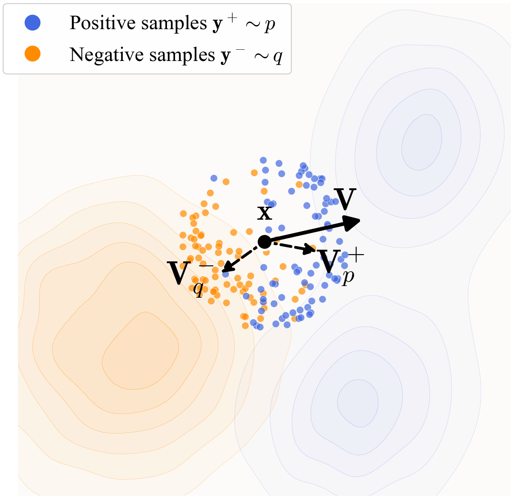

# 论文总结：Generative Modeling via Drifting

**论文地址**: https://arxiv.org/pdf/2602.04770

**作者**: Mingyang Deng, He Li, Tianhong Li, Yilun Du, Kaiming He（MIT, Harvard）

---

## 1. 这个工作解决了一个什么问题？

本文提出了 **Drifting Models**，一种新的生成式建模范式，旨在解决**单步生成**（one-step generation）问题。

**核心问题**：
- 现有的扩散模型/流模型需要在推理时进行多步迭代，计算开销大
- 知识蒸馏等方法可以将多步模型压缩为单步，但训练过程复杂
- 需要一种全新的范式，能够在**训练过程中自然演化**分布，从而实现**单步推理**

**本文目标**：提出一种在训练时就演化 pushforward 分布的生成模型，实现高质量单步图像生成。

> **图1说明**：Drifting Model 概念。网络 f 执行 pushforward 操作：q = f#pprior，将先验分布（如高斯分布）映射到 pushforward 分布 q（橙色）。训练目标是让 q 接近数据分布 pdata（蓝色）。训练过程中引入漂移场，当 q 匹配 pdata 时趋近于零。

---

## 2. What / Who / How / Why

| 要素 | 内容 |
|------|------|
| **What** | 提出 Drifting Models 范式，通过训练时的漂移场演化 pushforward 分布，实现单步生成 |
| **Who** | Mingyang Deng, He Li, Tianhong Li（MIT）, Yilun Du（Harvard）, Kaiming He（MIT） |
| **How** | 引入漂移场 V，通过正负样本的吸引/排斥机制驱动分布演化；使用特征空间的漂移损失训练 |
| **Why** | 传统扩散模型在推理时迭代，计算开销大；本文方法在训练时演化分布，推理时只需一步 |

---

## 3. 之前的工作及局限性

### 3.1 扩散/流模型

| 方法 | 特点 | 局限性 |
|------|------|--------|
| Diffusion models (Sohl-Dickstein 2015, Ho 2020) | 通过 SDE/ODE 迭代去噪 | 推理需要多步（250+ NFE） |
| Flow Matching (Lipman 2022) | 通过常微分方程映射 | 同样需要多步迭代 |

### 3.2 单步生成方法

| 方法 | 特点 | 局限性 |
|------|------|--------|
| 知识蒸馏 (Salimans 2022, Luo 2023) | 将多步模型蒸馏为单步 | 需要预训练多步模型 |
| 从头训练的单步扩散 (Song 2023, Frans 2024) | 近似扩散轨迹 | 仍依赖扩散/流公式 |

### 3.3 其他生成模型

- **GANs**：单步生成，但依赖对抗优化，训练不稳定
- **VAEs**：单步生成，但质量通常不如扩散模型
- **Normalizing Flows**：推理时单步，但需要可逆架构

### 3.4 本文 vs 之前工作

- 不依赖 SDE/ODE 公式
- 不使用对抗训练
- 在训练过程中自然演化分布

---

## 4. 方法详解（重点）

### 4.1 核心概念：训练时的 Pushforward

**Pushforward 分布**：给定神经网络 $f: \mathbb{R}^C \to \mathbb{R}^D$，输入噪声 $\epsilon \sim p_\epsilon$，输出 $x = f(\epsilon) \sim q$。$q$ 被称为 $p_\epsilon$ 在 $f$ 下的 pushforward 分布：
$$q = f_\# p_\epsilon$$

**训练过程**：神经网络的迭代训练本身就对应着 pushforward 分布的演化：$q_0 \to q_1 \to q_2 \to \cdots$

### 4.2 漂移场（Drifting Field）

**定义**：漂移场 $V_{p,q}(x)$ 是一个函数，给定样本 $x$，计算其漂移量 $\Delta x$：
$$x_{i+1} = x_i + V_{p,q_i}(x_i)$$

**反对称性（Anti-symmetry）**：作者证明了如果漂移场满足反对称性 $V_{p,q}(x) = -V_{q,p}(x)$，则当 $p = q$ 时，$V = 0$。

**吸引-排斥机制**：
$$V^+_p(x) = \frac{1}{Z_p} \mathbb{E}_{y^+ \sim p}[k(x, y^+)(y^+ - x)]$$
$$V^-_q(x) = \frac{1}{Z_q} \mathbb{E}_{y^- \sim q}[k(x, y^-)(y^- - x)]$$
$$V_{p,q}(x) = V^+_p(x) - V^-_q(x)$$

其中 $k(x, y) = \exp(-\frac{1}{\tau}\|x - y\|)$ 是核函数。

**直观理解**：样本 $x$ 被数据分布 $p$ 吸引，被生成分布 $q$ 排斥，当两者匹配时达到平衡。

> **图2说明**：漂移机制示意图。生成的样本 x（黑色）根据向量 V = V+ p − V− q 漂移。其中 V+ p 是正样本（蓝色）的 mean-shift 向量，V− q 是负样本（橙色）的 mean-shift 向量。x 被 V+ p 吸引，被 V− q 排斥。

### 4.3 训练目标

**损失函数**：
$$\mathcal{L} = \mathbb{E}_\epsilon \left[ \| f_\theta(\epsilon) - \text{stopgrad}(f_\theta(\epsilon) + V_{p,q_\theta}(f_\theta(\epsilon))) \|^2 \right]$$

**直观理解**：损失值等于 $\|V\|^2$，即漂移场的范数。当分布匹配时，漂移场为零，损失为零。

### 4.4 特征空间漂移

除了在原始数据空间应用漂移损失，还可以在**特征空间**应用：

$$\mathcal{L}_{feat} = \mathbb{E} \left[ \|\phi(x) - \text{stopgrad}(\phi(x) + V(\phi(x)))\|^2 \right]$$

其中 $\phi$ 是特征提取器（预训练的自监督模型，如 MoCo、SimCLR、MAE）。

**多尺度特征**：使用 ResNet 的多尺度特征，在每个尺度计算漂移损失。

### 4.5 无分类器引导（CFG）

**条件生成**：给定类别标签 $c$，负样本分布变为：
$$\tilde{q}(\cdot|c) = (1-\gamma) q_\theta(\cdot|c) + \gamma p_{data}(\cdot|\emptyset)$$

这与标准 CFG 的思想一致，但在本文中是**训练时**的行为，保持单步推理特性。

---

## 5. 实验结果

### 5.1 玩具实验

> **图3说明**：2D 玩具实验。分布 q（橙色）在训练过程中向双峰目标分布 p（蓝色）演化。展示了三种初始化：(上) 初始化在两峰之间；(中) 初始化远离两峰；(下) 初始化塌缩到单峰。所有初始化下，方法都能逼近目标分布，无模式塌缩。

> **图4说明**：样本演化过程。展示不同训练迭代下生成的点及其损失值。损失值（等于 ∥V∥²）随分布收敛到目标而减小（y 轴为对数刻度）。

### 5.2 ImageNet 256×256 实验

#### 5.2.1 反对称性消融实验

| 消融变体 | 漂移场设置 | FID |
|---------|-----------|-----|
| **反对称（默认）** | V+ − V− | **8.46** |
| 1.5×吸引 | 1.5V+ − V− | 41.05 |
| 1.5×排斥 | V+ − 1.5V− | 46.28 |
| 2.0×吸引 | 2V+ − V− | 86.16 |
| 2.0×排斥 | V+ − 2V− | 112.84 |
| 仅吸引 | V+ | 177.14 |

> **表1说明**：反对称性消融实验。破坏反对称性会导致灾难性失败。反对称设置工作良好，而其他设置完全失败。

#### 5.2.2 正负样本数量消融

| Nc | Npos | Nneg | B | FID |
|----|------|------|---|-----|
| 64 | 1 | 64 | 4096 | 20.43 |
| 64 | 16 | 64 | 4096 | 10.39 |
| 64 | 32 | 64 | 4096 | 8.97 |
| **64** | **64** | **64** | **4096** | **8.46** |

| Nc | Npos | Nneg | B | FID |
|----|------|------|---|-----|
| 512 | 8 | 8 | 4096 | 11.82 |
| 256 | 16 | 16 | 4096 | 10.16 |
| 128 | 32 | 32 | 4096 | 9.32 |
| **64** | **64** | **64** | **4096** | **8.46** |

> **表2说明**：正负样本分配消融实验。在相同计算预算下，增加正负样本数量都能提升生成质量。

#### 5.2.3 特征空间消融

| 特征编码器 | SSL方法 | 架构 | 宽度 | SSL轮次 | FID |
|----------|--------|------|------|--------|-----|
| SimCLR | SimCLR | ResNet | 256 | 800 | 11.05 |
| MoCo-v2 | MoCo-v2 | ResNet | 256 | 800 | 8.41 |
| latent-MAE | MAE | ResNet | 256 | 192 | 8.46 |
| latent-MAE | MAE | ResNet | 384 | 192 | 7.26 |
| latent-MAE | MAE | ResNet | 512 | 192 | 6.49 |
| latent-MAE | MAE | ResNet | 640 | 192 | 6.30 |
| latent-MAE | MAE | ResNet | 640 | 1280 | 4.28 |
| **latent-MAE + cls ft** | MAE | ResNet | 640 | 1280 | **3.36** |

> **表3说明**：特征空间漂移消融实验。latent-MAE 编码器表现最佳，增加宽度和训练轮次都能提升性能。

#### 5.2.4 模型规模扩展

| 变体 | 架构 | 轮次 | FID |
|------|------|------|-----|
| (a) 基线 | B/2 | 100 | 3.36 |
| (b) 更长训练 | B/2 | 320 | 2.51 |
| (c) 更长+调参 | B/2 | 1280 | 1.75 |
| **(d) 更大模型** | **L/2** | **1280** | **1.54** |

> **表4说明**：从消融到最终设置的扩展。更长训练和更大模型带来性能提升。

### 5.3 主实验结果

#### 5.3.1 Latent Space 生成（ImageNet 256×256）

| 方法 | 空间 | 参数量 | NFE | FID↓ | IS↑ |
|------|------|--------|-----|------|-----|
| **多步扩散/流模型** | | | | | |
| DiT-XL/2 | SD-VAE | 675M+49M | 250× | 22.27 | 278.2 |
| SiT-XL/2 | SD-VAE | 675M+49M | 250× | 22.06 | 270.3 |
| SiT-XL/2+REPA | SD-VAE | 675M+49M | 250× | 21.42 | 305.7 |
| **单步扩散/流模型** | | | | | |
| iCT-XL/2 | SD-VAE | 675M+49M | 1 | 34.24 | - |
| Shortcut-XL/2 | SD-VAE | 675M+49M | 1 | 10.60 | - |
| MeanFlow-XL/2 | SD-VAE | 676M+49M | 1 | 3.43 | - |
| iMeanFlow-XL/2 | SD-VAE | 610M+49M | 1 | 1.72 | 282.0 |
| **Drifting Models** | | | | | |
| Drifting Model, B/2 | SD-VAE | 133M+49M | 1 | **1.75** | 263.2 |
| **Drifting Model, L/2** | SD-VAE | 463M+49M | 1 | **1.54** | 258.9 |

> **表5说明**：Latent space 生成系统级对比。Drifting Model 在 latent space 达到 **1.54 FID**，超越所有单步方法，甚至可比拟多步方法。

#### 5.3.2 Pixel Space 生成（ImageNet 256×256）

| 方法 | 空间 | 参数量 | NFE | FID↓ | IS↑ |
|------|------|--------|-----|------|-----|
| **多步扩散/流模型** | | | | | |
| ADM-G | pixel | 554M | 250×2 | 4.59 | 186.7 |
| SiD, UViT/2 | pixel | 2.5B | 1000×2 | 2.44 | 256.3 |
| PixelDiT/16 | pixel | 797M | 200×2 | 1.61 | 292.7 |
| **GANs** | | | | | |
| BigGAN | pixel | 112M | 1 | 6.95 | 152.8 |
| GigaGAN | pixel | 569M | 1 | 3.45 | 225.5 |
| StyleGAN-XL | pixel | 166M | 1 | 2.30 | 265.1 |
| **Drifting Models** | | | | | |
| Drifting Model, B/16 | pixel | 134M | 1 | **1.76** | 299.7 |
| **Drifting Model, L/16** | pixel | 464M | 1 | **1.61** | 307.5 |

> **表6说明**：Pixel space 生成系统级对比。Drifting Model 在 pixel space 达到 **1.61 FID**，大幅超越之前的像素空间单步方法。

### 5.4 机器人控制实验

| 任务 | Diffusion Policy (100 NFE) | Drifting Policy (1 NFE) |
|------|---------------------------|------------------------|
| **单阶段任务** | | |
| Lift (State) | 0.98 | **1.00** |
| Lift (Visual) | 1.00 | 1.00 |
| Can (State) | 0.96 | **0.98** |
| Can (Visual) | 0.97 | **0.99** |
| ToolHang (State) | 0.30 | **0.38** |
| ToolHang (Visual) | **0.73** | 0.67 |
| PushT (State) | **0.91** | 0.86 |
| PushT (Visual) | **0.84** | 0.86 |
| **多阶段任务** | | |
| BlockPush Phase 1 | 0.36 | **0.56** |
| BlockPush Phase 2 | 0.11 | **0.16** |
| Kitchen Phase 1-4 | ≈1.00 | ≈0.98 |

> **表7说明**：机器人控制实验。Drifting Policy（1 NFE）与 Diffusion Policy（100 NFE）性能相当或更好。

---

## 6. 消融实验设计总结

### 消融实验设置

| 消融项 | 变体描述 | 对照组 | 主要结论 |
|--------|---------|--------|---------|
| **反对称性** | 破坏 V+−V− 的平衡 | 默认设置 | 反对称性对训练至关重要 |
| **正样本数量** | 改变 Npos | Npos=64 | 更多正样本提升性能 |
| **负样本数量** | 改变 Nneg | Nneg=64 | 更多负样本提升性能 |
| **特征编码器** | SimCLR, MoCo-v2, latent-MAE | latent-MAE | latent-MAE 效果最好 |
| **编码器宽度** | 256→384→512→640 | 640 | 更大的编码器提升性能 |
| **训练轮次** | 100→320→1280 | 1280 | 更长训练提升性能 |
| **模型规模** | B/2→L/2 | L/2 | 更大的生成器提升性能 |

---

## 7. 总结与思考

### 主要贡献

1. **新范式**：提出 Drifting Models，通过训练时的分布演化实现单步生成
2. **理论保证**：反对称漂移场确保分布匹配时达到平衡
3. **SOTA 性能**：ImageNet 256×256 上达到 1.54 FID（latent）和 1.61 FID（pixel）
4. **跨领域应用**：在机器人控制任务上同样有效

### 核心创新

- **训练时 vs 推理时**：传统扩散模型在推理时迭代，Drifting Models 在训练时就完成分布演化
- **漂移场机制**：通过正负样本的吸引-排斥实现分布匹配
- **特征空间漂移**：利用预训练自监督模型提升相似度度量

### 局限性

- 特征编码器的设计可能未达最优
- 反向蕴含（V=0 ⇒ p=q）理论上未完全证明
- 核函数设计可能有更优选择

### 思考

这篇文章的核心思想是将神经网络的迭代训练过程本身视为一种分布演化机制。不同于扩散模型在推理时通过多步迭代去噪，Drifting Models 利用训练时的参数更新来驱动分布演化，从而在推理时只需单步前向传播。这是一个概念上的根本转变，从"推理时的迭代"转向"训练时的演化"。
